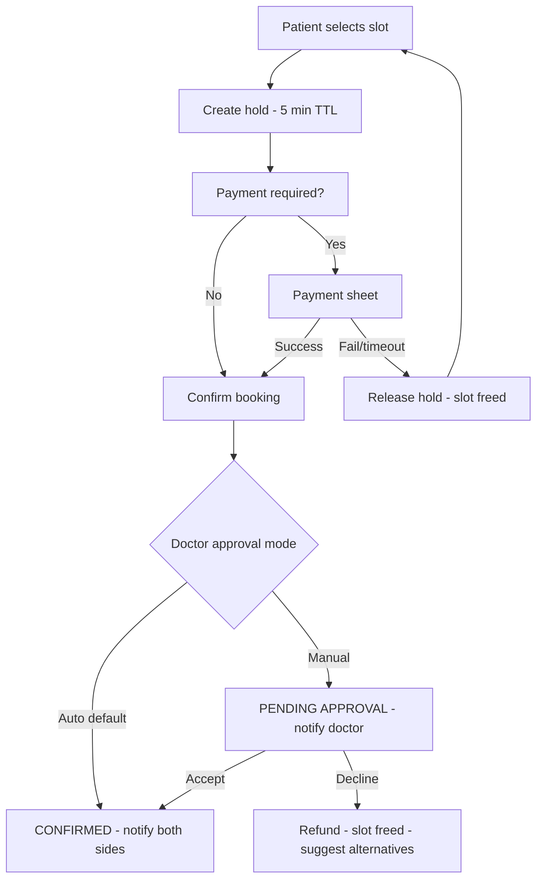
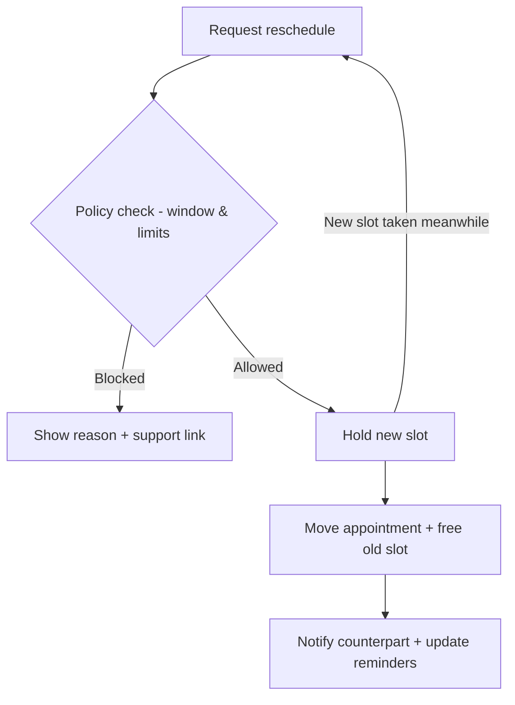
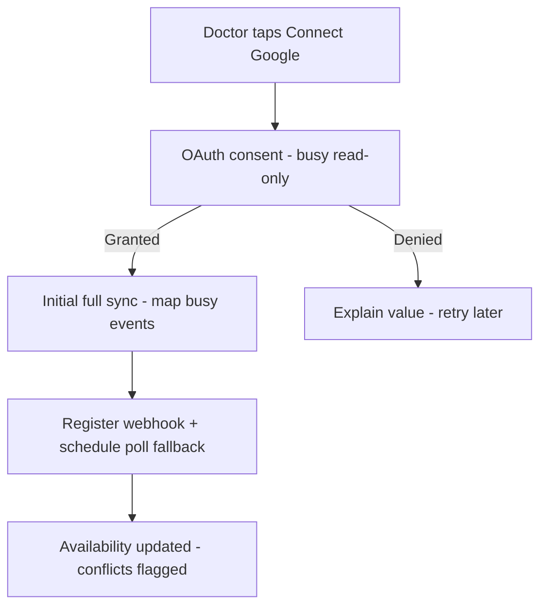
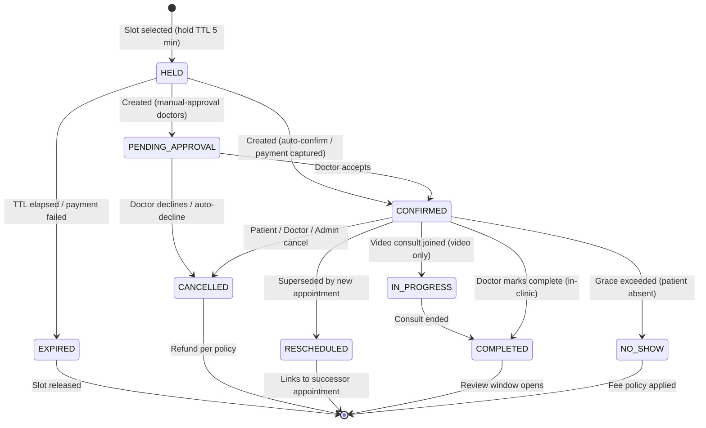

# MediBook — Product Requirements Document (PRD)

| | |
|---|---|
| **Product** | MediBook — Doctor Consultation & Appointment Platform (working title) |
| **Version** | 1.0 Draft |
| **Date** | 2026-09-14 |
| **Owner** | Product Management (assign) |
| **Reviewers** | UX Lead · Engineering Lead · QA Lead · Ops Lead · Legal/Compliance |
| **Companion** | [TRD.md](./TRD.md) · [Executive Summary](./README.md) |

---

## 1. Document Overview

### 1.1 Product name
**MediBook** (working title — see Open Question Q1).

### 1.2 Product description
A two-sided healthcare appointment platform delivered as **two mobile applications** (Patient App, Doctor App) and a supporting **Admin Web Console**. Patients discover verified doctors, view genuine real-time availability, book in-clinic or video consultations, pay, and manage appointments end-to-end. Doctors publish their professional profile, control their schedule, and connect their existing calendars (Google, Outlook; ICS feeds in Phase 2) so the platform's availability always mirrors reality. The platform guarantees no double-booking and keeps both sides informed at every step.

### 1.3 Document purpose
Define the *what* and *why* of the MVP and its follow-on phases precisely enough for UX to design, engineering to estimate, QA to test, and leadership to fund — while explicitly flagging what must still be decided (assumptions, open questions, compliance confirmations).

### 1.4 Target users
- **Patients / care seekers** — people booking for themselves or family members (including children and elderly dependents).
- **Doctors / practitioners** — independent clinicians across in-clinic and teleconsultation practice.
- **Platform operations staff** — admins who verify doctors, monitor the marketplace, handle support and refunds.

### 1.5 Business objective
Create a trusted, reliable appointment marketplace that (a) fills doctors' schedules with correctly-intentioned appointments, (b) makes finding and seeing a doctor faster than any alternative (phone calls, walk-ins, generic directories), and (c) builds a defensible moat through verification, calendar intelligence, and family-first booking.

### 1.6 Product vision
> *"Anyone can find the right doctor and book a real appointment in under two minutes — and it always holds."*
Phase 1 wins on **accuracy and trust**; later phases expand into continuity of care (records, chat, follow-ups) without a rewrite (TRD §18).

---

## 2. Problem Statement

### 2.1 For patients
- Finding a doctor is fragmented: directories are stale, availability is invisible, and booking means phone calls during working hours.
- Appointments get lost: no reminders, no easy rescheduling, no single place showing upcoming and past visits for *the whole family*.
- Teleconsultation options are opaque: which doctors consult online, at what fee, in the patient's timezone?
- Trust is low: is this doctor genuinely qualified? Will the appointment actually happen?

### 2.2 For doctors
- Doctors lose revenue to no-shows and gain chaos from double-bookings between their own calendar(s) and patient bookings managed by front-desk staff or personal memory.
- Existing tools are desk-bound (web PMS) and don't travel with the doctor; updates (leaves, emergencies) don't propagate to patients.
- Online presence is scattered (aggregator listings, WhatsApp, word-of-mouth) with no control over profile accuracy or fees.
- Payment collection and refund handling for cancellations is manual and error-prone.

### 2.3 For healthcare operations (the platform business)
- Unverified supply is a safety and legal risk; verification must be systematic, not ad hoc.
- Disputes (cancellations, no-shows, refunds) need an auditable trail and tooling.
- The marketplace needs instrumentation: funnel metrics, utilization, and quality signals to balance supply and demand.

---

## 3. Product Goals

Measurable goals for 6 months post-launch (targets are proposals — confirm with leadership):

| # | Goal | Metric | Target |
|---|---|---|---|
| G1 | Fast, successful booking | Median time from open app to confirmed booking | < 3 minutes |
| G2 | Booking integrity | Double-booking incidents reaching a patient | 0 (engineered guarantee) |
| G3 | Trust supply | Doctors listed with completed verification | 100% |
| G4 | Demand conversion | Search → confirmed booking conversion | ≥ 12% |
| G5 | Reliability of intent | Patient no-show rate | ≤ 10% (with reminder stack) |
| G6 | Doctor reliability | Doctor-initiated cancellations | ≤ 5% of bookings |
| G7 | Calendar intelligence adoption | Verified doctors with ≥1 connected calendar | ≥ 60% in 90 days |
| G8 | Engagement | Appointments with a completed post-visit rating | ≥ 25% |
| G9 | Quality bar | Crash-free sessions (both apps) | ≥ 99.5% |
| G10 | Support load | Appointments requiring admin intervention | ≤ 2% |

North-star metric: **completed consultations per week** (not bookings — completions reflect both sides showing up).

---

## 4. User Personas

### 4.1 Primary — Priya Sharma, 34, working mother (Patient)
- Books for herself, her son (7), and occasionally her parents. Time-poor; books evenings on mobile.
- **Needs:** find a pediatrician near home or online quickly; see real slots; pay by card/UPI; get reminders she doesn't have to manage; move an appointment when work changes.
- **Pain points today:** calls clinics during work; keeps appointments in her head; no-shows when plans shift because rescheduling is harder than skipping.
- **Success looks like:** "I booked the whole family's dentist and pediatrician appointments in one app, and they reschedule themselves when I need."

### 4.2 Primary — Dr. Arjun Mehta, 41, dermatologist (Doctor)
- Sees patients at two clinic locations + teleconsults from home. Lives in Google Calendar; hates double-booking.
- **Needs:** control over schedule, buffer between patients, leaves and blocks that instantly hide slots; verified badge to stand out; no-show protection; notifications for new/cancelled bookings.
- **Pain points today:** front desk double-books when his calendar changes; aggregator listings show wrong fees; chasing cancellations over WhatsApp.
- **Success looks like:** "My calendar is my schedule. If I'm busy, the app knows. If a patient cancels, I know in seconds."

### 4.3 Primary — Meera Rao, 29, Platform Operations (Admin)
- Verifies onboarding doctors, monitors today's appointments, resolves disputes and refunds, tunes the specialization catalog.
- **Needs:** a verification queue with clear reject reasons, search across patients/doctors/appointments, refund tooling with policy guardrails, audit logs for every action.
- **Pain point today (pre-platform):** everything over email/WhatsApp with no trail.
- **Success looks like:** "Every doctor was verified before going live, and every dispute has a traceable history."

### 4.4 Secondary personas
- **Ramesh, 68, low digital literacy** — large text, simple flows, SMS reminders, assisted rebooking; drives our accessibility bar (PRD §16).
- **Dr. Kavya Iyer, 36, telehealth-only practitioner** — patients across timezones; depends on timezone-correct display (PRD §13 R9) and video reliability.
- **Front-desk Sana (Future)** — clinic staff managing a doctor's calendar; kept out of MVP by the doctor-account-per-practitioner assumption (A7).

---

## 5. User Roles & Permissions

| Capability | Patient (unauthenticated) | Patient | Doctor | Admin |
|---|---|---|---|---|
| Browse/search doctor listings & profiles | ✅ (limited) | ✅ | — | ✅ |
| View availability | ✅ (limited) | ✅ | Own + own bookings | ✅ |
| Book / pay | ❌ (prompted to register) | ✅ (self + dependents) | ❌ | ❌ (ops exception path only) |
| Reschedule / cancel | ❌ | ✅ (own + dependents' bookings, within policy) | ✅ (own appointments) | ✅ (with reason; audited) |
| Join video consultation | ❌ | ✅ (own appointment, at start window) | ✅ (own appointment) | ❌ |
| Rate & review | ❌ | ✅ (after completed appointment) | ❌ (respond Phase 2) | ✅ (moderate/remove) |
| Manage profile / preferences | ❌ | ✅ (own + dependents) | ✅ (professional profile) | ✅ (platform config) |
| Configure schedule, fees, calendar | ❌ | ❌ | ✅ | ❌ |
| Verify doctors | ❌ | ❌ | ❌ (submit documents) | ✅ |
| Issue refunds | ❌ | ❌ (request via cancel flow) | ❌ | ✅ (within policy guardrails) |
| View audit logs / platform config | ❌ | ❌ | ❌ | ✅ |
| Delete account | ❌ | ✅ (own data; privacy-compliant) | ✅ (initiate; admin-assisted offboarding with future-appointment handling) | ❌ (can deactivate, not erase) |

Rule of least privilege throughout; doctors never see other patients; patients never see other patients' data; every admin write is audit-logged (TRD §12).

---

## 6. Product Scope

### 6.1 MVP (first release)

**Patient App**
- Phone/email OTP registration & login; profile; **dependent/family member profiles**; notification preferences.
- Doctor discovery: search (name, specialization), filters (availability day/today, consultation type, fee range, sort by experience/fee/rating), location-aware listing (Phase 2 for geo-ranking; MVP = city/area text).
- Doctor profile: photo, qualifications, specialization(s), experience, registration/verified badge, languages, clinic address (in-clinic), bio, consultation types & fees, ratings & reviews.
- Availability browsing by day; slot times shown in the patient's timezone.
- Booking: select slot → (dependent selector) → confirm details → pay (if fee > 0) → confirmation; **slot hold during payment**; free consults skip payment.
- Appointments: upcoming & past lists; detail view (with add-to-calendar for the patient); **reschedule** (per policy); **cancel** (per policy, refund status shown); join video consult (T-5 min window); receipts/invoices.
- Notifications: push + in-app for all appointment events; email/SMS for confirmations, cancellations, and reminders (see PRD §12 matrix).
- Ratings & reviews after completion (one review per completed appointment).
- Account: logout, device management (basic), account deletion request (compliance-driven).

**Doctor App**
- Registration with professional details + **verification submission** (registration number, council/board, ID document, optional degree certificates); status tracking (pending/approved/rejected with reason).
- Professional profile editor: photo, bio, qualifications, specializations, experience, languages, clinic address(es) (single location MVP), consultation types (in-clinic / video), fee per type, duration per type.
- Availability: weekly template (days × start/end × slot duration × buffer), date exceptions (leaves, one-off blocks), future-dated changes.
- **Calendar connect**: Google Calendar and Outlook (Microsoft 365/Outlook.com) via OAuth; sync status; manual re-sync; disconnect; multi-account support (one account per provider at MVP is acceptable, multiple supported).
- Appointments: today view, upcoming/past, accept/decline (only in manual-approval mode — default off), reschedule (offer from doctor's open slots), cancel (auto-refund triggered), mark no-show, mark completed.
- Patient context per appointment: patient name, dependent info if applicable, age/gender, booking notes, appointment history *with this doctor only*.
- Notifications: new booking, cancellation, reschedule proposals/confirmations, reminder digest, calendar conflict alerts, verification status.

**Admin Console (Web)**
- Admin auth with MFA; role-gated modules.
- Doctor verification queue: review submitted documents, approve / reject with structured reason; re-verify on profile changes to licensed fields.
- Doctor & patient management: search, view, suspend/reinstate doctors (cascades to availability), deactivate patients.
- Appointment oversight: cross-marketplace search, manual cancel with mandatory reason (audited), no-show adjudication.
- Refund operations: refund queue from cancellations, approve/execute within policy guardrails, mark exceptions.
- Catalog: specialization taxonomy management; platform configuration (booking windows, cancellation windows, hold duration, no-show grace, default buffers).
- Reports: core funnel dashboard (PRD §15 metrics), daily appointments summary, export CSV.
- Audit log viewer; notification template viewer (edit is Phase 2).

**Backend Platform** — everything the above requires (TRD §5), including the concurrency-safe slot engine, calendar sync, notifications, payments/refunds, and analytics event pipeline.

### 6.2 Phase 2
- ICS/Apple published-calendar feed sync (read-only busy); per-doctor manual approval mode refinements (decline-with-suggestion).
- Waitlist & auto-rebook on cancellation; smart reschedule suggestions to patients.
- In-app chat (patient↔doctor, bounded pre/post appointment); consultation notes & prescriptions (structured templates).
- Doctor earnings dashboard & payouts (platform-commission model); saved payment methods; partial-refund policy engine.
- WhatsApp notifications; multi-location clinics & clinic staff roles; location-based ranking with geo search; referral program; review responses; patient-facing add-to-phone-calendar sync (native).
- Accessibility hardening pass 2; additional languages.

### 6.3 Future / Advanced
- Two-way CalDAV; insurance & claims; health record attachments & FHIR-based interoperability; AI-assisted triage and specialty routing; no-show risk scoring and smart overbooking guidance; group classes/webinars; labs & pharmacy marketplace; white-label/multi-tenant; ABDM/HIE integrations where mandated.

### 6.4 X-Factors (differentiators, phased)

| # | X-Factor | Tier | Why it wins |
|---|---|---|---|
| X1 | **Conflict-free calendar intelligence** — external busy time auto-hidden; conflicts detected before patients see stale slots; proactive doctor alerts with one-tap fixes | MVP (Google/Outlook) → P2 (ICS) | Directly attacks the #1 trust killer |
| X2 | **Family-first booking** — dependents, shared family appointment view, per-member history | MVP | Sticky multi-user engagement most competitors lack |
| X3 | **Booking integrity guarantee** — engineered no-double-booking, visible slot holds, honest "last verified" freshness on availability | MVP | Reliability as a brand promise |
| X4 | **Timezone-native telehealth** — all times stored UTC, rendered per viewer; DST-safe; explicit timezone labels on cross-region bookings | MVP | Unlocks borderless doctor supply |
| X5 | **Verified supply** — human-verified licenses with visible badge and verification date | MVP | Trust for both sides |
| X6 | **Smart rebooking** — cancellation triggers next-available suggestions; waitlist auto-fill | Phase 2 | Converts cancellations into recovered revenue |
| X7 | **No-show protection** — reminder stack + gentle deposit behavior + (future) risk scoring | MVP reminders → Future ML | Doctors' #1 economic complaint |
| X8 | **Offline-tolerant apps** — critical screens cache; queued actions with conflict-safe replay | MVP (read) → P2 (write queue) | Real-world networks |
| X9 | **Accessibility-first** — WCAG 2.2 AA target, elderly-friendly flows, SMS safety net | MVP | Underserved segment + differentiation |
| X10 | **Localization-ready architecture** — i18n/RTL/LTR from day one | MVP-ready, P2 rollout | Cheap market expansion |

---

## 7. Information Architecture

### 7.1 Patient App (bottom tabs: Home · Discover · Appointments · Alerts · Profile)
```
Home
├─ Greeting + next appointment card (join/reschedule/cancel shortcuts)
├─ Quick actions: Book by specialty · Rebook last doctor · Book for family member
└─ Health tips slot (static MVP)
Discover
├─ Search bar + specialty chips
├─ Filters (availability, consultation type, fee, language, gender, sort)
├─ Doctor list → Doctor Profile
│   ├─ About (quals, experience, registration, verified badge)
│   ├─ Consultation types & fees
│   ├─ Reviews
│   └─ Availability calendar → Slot picker → Booking sheet
│       (patient/dependent selector → summary → payment → confirmation)
Appointments
├─ Upcoming (cards: doctor, who it's for, time w/ tz label, mode, actions)
│   └─ Detail → Reschedule · Cancel · Join video · Directions · Add to calendar · Receipt · Help
├─ Past (detail → rate & review · rebook · receipt)
└─ Family view toggle (per member filter)
Alerts (in-app notification inbox; settings shortcut)
Profile
├─ My details (edit) · Family members (CRUD) · Saved doctors (favorites)
├─ Notification preferences · Language (P2) · Help & support · Legal (privacy/terms)
└─ Logout · Delete account
```

### 7.2 Doctor App (bottom tabs: Today · Appointments · Schedule · Patients · Profile)
```
Today
├─ Status header (verified badge · online/away toggle P2)
├─ Timeline of today's appointments (checked-in/in-clinic/video states)
├─ Conflict alerts banner (calendar conflicts, unconfirmed approvals)
└─ Quick stats (today: count, cancellations, next free slot)
Appointments
├─ Upcoming / Pending approval (if manual mode) / Past filters
└─ Detail → Accept/Decline · Reschedule (open slots picker) · Cancel
    · Mark no-show · Mark completed · Patient context
Schedule
├─ Weekly template editor (days, hours, slot duration, buffers, consult type fees)
├─ Exceptions (leaves & blocks calendar view)
├─ Calendar connections (Google / Outlook · sync status · re-sync · disconnect)
└─ Booking policy (min notice, booking window, approval mode toggle)
Patients
└─ Seen patients list → patient context (history with this doctor only)
Profile
├─ Professional profile (photo, bio, quals, specializations, experience, languages)
├─ Verification status & documents · Clinic address · Fees & durations
├─ Notification preferences · Help · Legal
└─ Logout · Deactivation request
```

### 7.3 Admin Console (Web; left nav)
```
Dashboard (KPIs, today at a glance)
Doctors (verification queue · all doctors · suspended)
Patients (search · detail · deactivate)
Appointments (search/filter · oversight actions)
Refunds (queue · exceptions)
Catalog (specializations)
Reports (funnel, utilization, exports)
Notifications (template viewer)
Configuration (policy knobs, feature flags)
Audit Logs
Support (ticket inbox P2)
Admins & Roles (settings)
```

---

## 8. End-to-End User Journeys

### 8.1 Patient journeys

**J1 — Registration & profile setup**
1. Opens app → guided carousel → "Get started".
2. Enters phone (or email) → OTP → verifies (3 attempts, resend cooldown; see PAT-002).
3. Sets name, gender, DOB (or age), optional photo; grants notification permission with a value-first explanation.
4. Prompt (skippable): "Add a family member" → adds dependent (name, relationship, age).
5. Lands on Home with a next-best-action hint ("Find a doctor").
*Branches:* OTP fails 3× → cooldown + email path; permission denied → app fully usable, SMS fallback emphasized later.

**J2 — Doctor discovery & selection**
1. Discover tab → search "dermatologist" or taps specialty chip; applies filter "Available today" + "Video".
2. Scans result cards (fee, next slot, rating, verified badge, distance/area) → opens profile.
3. Reviews qualifications, experience, reviews, fees; compares 2–3 doctors (back navigation preserved); saves one to favorites.
4. Taps "Book" → availability calendar defaults to first day with open slots.

**J3 — Availability → booking → payment → confirmation**
1. Slot picker shows day strip + slot grid; slots render in patient's timezone with explicit tz label when booking a cross-region video consult; "last synced" freshness note where calendar data is recent.
2. Selects slot → booking sheet: who is it for (self/dependent), consultation type, fee breakdown, cancellation policy summary.
3. Taps "Confirm & Pay" → **slot held 5 minutes** (visible countdown); payment sheet (card/UPI/etc. by market) → success.
4. Confirmation screen: appointment code, add-to-calendar, directions (in-clinic) or "how to join" (video); receipt emailed.
*Branches:* payment fails → hold released, slot freed, retry offered; hold expires → back to slot picker with slot re-validated; slot taken by someone else mid-flow → honest "that slot was just taken" + nearest alternatives.

**J4 — Pre-consultation & reminders**
1. T-24h: push+email reminder; T-2h: push+SMS; video consults: T-10m join prompt.
2. In-clinic: reminder shows clinic address, directions link, "what to bring" tip.
3. Patient can reschedule/cancel from the reminder deep-link (policy applies).

**J5 — Consultation (video)**
1. Join button activates T-5m before start; pre-join check (camera/mic permissions, network hint).
2. In-call: minimal controls (mute, camera, end); timer; doctor admits patient.
3. Post-call: rating prompt + "book follow-up" shortcut.
*Branches:* doctor late > grace → patient sees honest status ("Doctor is running late") + options; technical failure → rejoin + support path + auto-compensation policy if consult cannot happen (PRD §14).

**J6 — Reschedule**
1. Appointment detail → Reschedule → policy check (see PRD §13 R3).
2. Same doctor's open slots picker (defaults near original time) → picks new slot → holds new slot → confirms (payment delta rules: none for same fee) → old slot freed automatically.
3. Confirmation updated on both sides; history keeps the trail.

**J7 — Cancellation & refund**
1. Detail → Cancel → reason picker (optional note) → policy preview ("Free now · fee after…") → confirm.
2. Refund (if applicable) initiated automatically; status visible on the receipt; confirmation of cancellation to both sides; doctor slot freed immediately.

**J8 — History, reviews & rebooking**
1. Past tab lists completed visits per family member; taps "Rate" → stars + optional text (submitted once, editable 24h, moderated).
2. "Rebook" shortcut pre-fills doctor + type → availability.

### 8.2 Doctor journeys

**J9 — Registration & verification**
1. Downloads app → registers with phone/email OTP → selects "I'm a doctor".
2. Enters professional identity: full name as per registration, registration number, council/board, country, specialty; uploads ID + license document (camera or file).
3. Sees "Under review — typically within 24h"; app remains in **setup mode** (can complete everything except going live).
*Branches:* rejection → structured reason + resubmission loop; 72h SLA breach → admin escalation (ADM-002).

**J10 — Profile & schedule setup (before go-live)**
1. Completes profile: photo, bio, qualifications (degree/institution/year), experience years, languages, clinic address + map pin, consultation types with fees and durations (e.g., In-clinic 20 min ₹600; Video 15 min ₹500).
2. Builds weekly template: Mon–Fri 10:00–13:00 & 16:00–19:00, 15-min slots, 5-min buffers; adds leaves (vacation week) and blocks.
3. Sets policy: min booking notice 2h, window 60 days, auto-confirm ON.
4. **Connects Google Calendar** → OAuth consent (read-only busy) → initial sync → banner: "Your Google busy time is now respected."
5. Sees "Ready to go live" checklist complete → status flips to **Live** after admin approval → discoverable by patients.

**J11 — Daily operating loop**
1. Morning: Today timeline shows the day's patients with buffers; conflict banner if overnight calendar events overlap bookings.
2. Between patients: marks completed / no-show (grace-configurable); quick-glance patient context before each consult.
3. Video consults: joins from the appointment card at start time; admits patient.
4. New booking arrives mid-day → instant push + timeline insert (auto-confirm mode) or accept/decline (manual mode).

**J12 — Change management (reschedule / cancel / leave)**
1. Emergency: cancels one appointment → patient auto-notified with apology template + rebooking link + full refund triggered; doctor sees cancellation count impact.
2. Leaves early: blocks the rest of today → affected future slots today hidden; *already-booked* appointments generate a proactive resolution list (reschedule or cancel each).
3. Vacation: date-range leave → same resolution flow; system refuses to silently strand booked patients (PRD §14 EC-01).

**J13 — Calendar-connected life**
1. Doctor's assistant adds an external event ("conference call 11:00–11:30") to Google Calendar → webhook fires → platform hides the overlapping platform slots within seconds.
2. External event collides with an **existing platform booking** → conflict alert to doctor (never auto-cancel): "Your 11:00 patient conflicts with an external event — Reschedule / Keep."
3. Doctor revokes access from Google security page → platform detects, marks account disconnected, stops subtracting external busy time, alerts doctor with one-tap reconnect.

### 8.3 Admin journeys

**J14 — Login & verify a doctor**
1. Console login (email + password + TOTP MFA).
2. Verification queue → opens Dr. Mehta's submission: license document, registration number, profile completeness.
3. Cross-checks number against council register (manual MVP) → Approve (doctor goes live) or Reject with structured reason → doctor notified; action audit-logged.

**J15 — Monitor & operate**
1. Dashboard: today's appointments, cancellation spikes, sync-failure alerts, payment mismatches.
2. Drills into an anomaly (e.g., doctor X calendar sync failed 6h) → contacts doctor via listed phone → resolves.
3. Handles a dispute: patient paid, doctor no-show → verifies trail → executes full refund + records reason → both sides notified.

**J16 — Support & issue handling**
1. Support inbox (MVP: appointments flagged + contact-us emails routed) → categorize → resolve using oversight tools → close with resolution note (audit-logged).

### 8.4 Key flow diagrams

**Booking (happy path + integrity gates):**


**Reschedule (patient):**


**Doctor calendar connect:**


---

## 9. Functional Requirements

Conventions: Priority **M** = MVP must-have, **S** = MVP should-have (cut-line candidate), **P2** = Phase 2. Preconditions assume the user is authenticated in the stated role unless noted. Standard error handling (network loss, session expiry, validation) applies to all requirements (PRD §14, TRD §14). Success criteria = observable behavior in the listed scenarios.

### 9.1 Patient Account & Profile (PAT)

| ID | Feature | Description & System Behavior | Errors / Edge Cases | Pri |
|---|---|---|---|---|
| PAT-001 | Register | Register via phone (primary) or email; issue OTP; on verify create account with role=patient; create empty profile. | Invalid/expired OTP (3 attempts → 60s cooldown); duplicate registration → login instead; number later ported/reused → re-verification on suspicious change. | M |
| PAT-002 | Login / OTP | OTP login for existing accounts; device token registered for push. | Too many requests → rate limited with human messaging; account deactivated → clear status message. | M |
| PAT-003 | Profile | View/edit name, photo, gender, DOB/age, phone/email, emergency contact. DOB required before first booking (age gates some flows). | Photo upload: size/type limits, EXIF stripped (TRD §12); email change → re-verify; phone change → OTP re-verify + notification to old contact. | M |
| PAT-004 | Dependents | Add/edit/remove family members (name, relationship, age/DOB, gender, notes). Bookings can be made for any dependent; per-member appointment history. | Minor without guardian age → require adult account holder (Q8 consent); max 10 dependents; removing a dependent with upcoming appointments → require reassignment/cancel first. | M |
| PAT-005 | Preferences | Notification channel toggles (push/email/SMS per category), language (P2 display). | Defaults sensible for critical events (cancellations cannot be fully muted). | M |
| PAT-006 | Favorites | Save/bookmark doctors; favorites surfaced on Discover & Home. | Favorited doctor deactivates → hidden from lists with explanatory state. | M |
| PAT-007 | Account lifecycle | Logout (current/all devices P2); delete account → soft-delete + anonymization workflow per compliance; data export request (P2). | Deletion blocked while upcoming paid appointments exist → resolve first; doctor-initiated deletion → admin-assisted offboarding (DOC-016). | M |
| PAT-008 | Search & filters | Search by doctor name/specialty; filters: availability (today/tomorrow/day), consult type, fee range, language, gender; sort: experience, fee (low-high), rating, next-available. | Empty results → relaxation suggestions; deep-link search state survives back-nav. | M |
| PAT-009 | Doctor profile view | Full profile incl. verified badge, qualifications, registration number (masked per policy Q9), fees per type, reviews, location/map (in-clinic), languages. | Unverified/deactivated doctor → not found (never partially visible). | M |
| PAT-010 | Reviews view | Reviews on profile: rating distribution + recent comments; only from completed appointments. | Moderated/removed reviews excluded; no review fabrication. | M |

### 9.2 Doctor App — Onboarding & Profile (DOC)

| ID | Feature | Description & System Behavior | Errors / Edge Cases | Pri |
|---|---|---|---|---|
| DOC-001 | Registration | OTP register → role=doctor → onboarding checklist shown (profile, schedule, verification). | Duplicate registration → support path; switching person/device → normal auth. | M |
| DOC-002 | Verification submission | Submit registration number, council/board, country, license document (photo/PDF), government ID. Status: `pending → under_review → approved / rejected(reason)`. Editable while pending; licensed-field edits after approval return doctor to re-review (discoverability paused until re-approved). | Blurry/rejected docs → structured reasons; fraud signals (duplicate registration number across accounts) → admin review; status visible in-app at all times. | M |
| DOC-003 | Professional profile | Manage photo, display name, bio, qualifications (list CRUD), specializations (from admin catalog, 1 primary + up to 3), experience years, languages, clinic address + map pin, gender (for patient filters). | Profile completeness meter gates "go live"; changes to non-licensed fields are instant; catalog item retired → doctor re-picks. | M |
| DOC-004 | Consultation config | Per type (in-clinic/video): enable toggle, fee (currency by market), duration, enable window. Fee changes apply to future bookings only. | Fee=0 allowed (free consults); absurd values validated; video requires device with camera (graceful on tablets). | M |
| DOC-005 | Weekly availability template | Weekly recurring rules: day(s) + start/end times, slot duration, buffer between appointments, which consult type(s) the block serves. Multiple windows per day. | Overlapping windows prevented; DST-shift warnings; changes affect future slots only unless "apply now and resolve conflicts" chosen (then PRD §14 EC-01 flow). | M |
| DOC-006 | Exceptions — leaves & blocks | Date/date-range leaves; one-off time blocks. Future-dated. Blocking time with existing bookings → resolution list (reschedule/cancel each; never silent). | Past-dated edits locked after fact; recurring leaves (e.g., every Sunday) via template. | M |
| DOC-007 | Booking policy per doctor | Min booking notice (default 2h), booking window (default 60d), approval mode (auto/manual; default auto), no-show grace (default 10m tele / 15m clinic). | Policy changes never invalidate existing bookings, only future availability. | M |
| DOC-008 | Calendar connect | Connect Google and/or Outlook via OAuth (busy/free read scope only); multiple accounts supported; per-account status (connected/syncing/error/expired), last-synced time, manual re-sync, disconnect. Privacy: only busy/free segmentation is stored and used — event titles/details are never shown to patients or stored in plaintext beyond sync needs (TRD §9). | OAuth denied/cancelled → clear value explanation, retry; token expired → re-auth prompt; sync failure → alert + slots remain from last good sync + booking-time re-check (TRD §10). | M |
| DOC-009 | Disconnect calendar | Remove an account: delete stored tokens & mapped events (audit-logged); external busy time no longer subtracted. | In-app disconnect vs provider-side revoke both handled (webhook + token-error detection). | M |
| DOC-010 | Appointment inbox | Today timeline + Upcoming + Past + (manual mode) Pending-approval queue. Real-time updates for new/cancelled/rescheduled. | Clock/timezone label per appointment (doctor's clinic tz primary); offline → cached list + queued actions with re-validation. | M |
| DOC-011 | Accept / decline (manual mode) | On new request: accept (confirm) or decline (auto-refund + patient suggested alternatives). Sliding 15-min auto-decline window configurable; expiry = decline. | Doctor unreachable → auto-decline with refund + admin alert if pattern repeats. | M (mode toggle), S default |
| DOC-012 | Reschedule (doctor) | Propose same slot or pick from own open slots; patient confirms proposal (P2: auto-apply with notification) — MVP: doctor's reschedule **directly moves** the appointment and notifies the patient with full details + revert-to-original offer for 1h. | Repeated reschedules by doctor → patient protection messaging + admin metric. | M |
| DOC-013 | Cancel (doctor) | Cancel with reason → patient notified with apology template + rebooking assistance + **automatic full refund**. | Mass-cancellation (emergency) → bulk flow with per-patient resolution; high rate → admin review flag. | M |
| DOC-014 | No-show / completion | Mark patient no-show (after grace; fee policy applies per PRD §13 R7); mark completed (ends appointment, enables review, updates history). | Patient disputes no-show → admin adjudication trail; accidental completion reversible within 24h by doctor. | M |
| DOC-015 | Patient context | Per appointment: patient/dependent name, age/gender, booking note, visit history **with this doctor only**, no-show history (this doctor). | Strict access scoping (TRD §12); no cross-doctor visibility. | M |
| DOC-016 | Deactivation / offboarding | Doctor requests deactivation → guided offboarding: resolve future appointments (reschedule/cancel with refunds), payout clarity note (P2), data retained per compliance policy. | Admin can suspend with same cascade (audited, both notified). | M |

### 9.3 Appointment Engine (APT)

| ID | Feature | Description & System Behavior | Errors / Edge Cases | Pri |
|---|---|---|---|---|
| APT-001 | Slot availability query | For doctor+type+date range: generate slots from template, subtract exceptions, existing bookings, external busy time, buffers; apply min-notice & window; return with statuses and freshness metadata. Patient sees own held/booked slots distinctly. | Timezone-correct output; stale-cache protection via booking-time re-validation. | M |
| APT-002 | Slot hold | On booking start: hold slot for 5 min (configurable) with visible countdown; one active hold per patient; slot invisible to others while held. | Hold expiry → release + notify in-flow patient; app killed mid-flow → hold expires server-side. | M |
| APT-003 | Create booking | Validate slot still free at commit (re-check), create appointment (status per approval mode), attach payment, **guarantee no double-booking** (TRD §10). Idempotent on client retry. | Concurrent takers → exactly one wins; loser gets 409 + nearest alternatives; clock-skew and DST handled server-side. | M |
| APT-004 | Payment | For fee>0: collect within hold window (payment methods per market Q11); receipt generated; free consults skip. | Payment success + booking commit failure impossible-by-design ordering + reconciliation job (TRD §10.6); duplicate webhooks deduped. | M |
| APT-005 | My appointments | Upcoming (next-first) & Past lists; family view filter (by member); pull-to-refresh; deep links. | Long history pagination; timezone-correct grouping by day. | M |
| APT-006 | Appointment detail | Full context: doctor, who it's for, type, duration, time w/ tz, location/join, status, fee & receipt, policy hints, actions per role/state. | Status change pushes update detail live. | M |
| APT-007 | Reschedule (patient) | Per PRD §13 R3: window ≥4h before start (configurable), max 2 reschedules per appointment, within doctor's booking window; free for same-type same-fee; moves slot atomically; notifications both sides. | New-slot contention → re-pick; policy exhausted → support path; doctor-initiated change pending → block simultaneous patient change. | M |
| APT-008 | Cancel (patient) | Per PRD §13 R2 window rules; reason picker; refund auto-initiated per policy; slot freed immediately. | Last-minute cancel → fee per policy (clear pre-book disclosure); doctor already en-route states — policy still applies; repeated last-minute cancels → future booking friction flags (P2). | M |
| APT-009 | Join video consult | Join enabled T-5m → T+grace; pre-join device check; in-call controls; rejoin allowed during window; consult auto-closes at end+grace. | Permission denied → guided settings; network poor → quality hints + phone fallback note; doctor no-show at consult → patient can flag (auto-refund path Q). | M |
| APT-010 | Reminders | Reminder stack per PRD §12 matrix (T-24h, T-2h, T-10m video join); respect quiet hours for non-critical channels. | Reminder after reschedule recomputed; cancelled appointments never reminded. | M |
| APT-011 | Ratings & reviews | One review per completed appointment (rating 1–5 + optional text ≤500 chars); editable 24h; visible on doctor profile after moderation pass (auto-publish + report button MVP). | No-show or cancelled → cannot review; abusive content → report → admin moderation (REV-002). | M |
| APT-012 | Receipts & invoices | Digital receipt per payment/refund; downloadable PDF (P2 invoice fields per market). | Refund receipt reflected; tax fields per market (Q2). | M |
| APT-013 | Add to personal calendar | Patient/doctor can export a single appointment (.ics) or rely on native calendar intent. | .ics includes tz-correct times + join link (video). | S |
| APT-014 | Refund status | Visible refund lifecycle on receipt/detail: initiated → processing → completed/failed(with retry hint). | Failed refund → admin alert + retry; timeline SLA messaging. | M |

### 9.4 Calendar Integration (CAL) — product rules

| ID | Feature | Description & System Behavior | Errors / Edge Cases | Pri |
|---|---|---|---|---|
| CAL-001 | Connect account | OAuth connect for Google / Outlook (see DOC-008); explicit scope disclosure ("We only read busy/free times — never event details"); consent stored; initial sync on connect. | Partial consent (scope reduced) → block connect with explanation; corporate tenants restricting OAuth → guidance fallback. | M |
| CAL-002 | Sync & freshness | Incremental sync via provider webhooks; poll fallback (≤15 min); every availability response carries freshness ("Synced 2 min ago"). | Webhook missed → poll catches up; provider outage → last-good-sync state + booking-time re-check. | M |
| CAL-003 | Manual re-sync | Doctor-triggered immediate sync with progress + result summary ("3 busy events imported, 0 conflicts"). | Rate-limit respected; repeated manual syncs throttled. | M |
| CAL-004 | Conflict handling | External busy event overlapping an **existing platform appointment** → conflict banner + notification to doctor with Reschedule/Keep actions; **never auto-cancel** a platform appointment. Overlap with *unbooked* slot → slot hidden (no user action). | Conflict resolved externally (event deleted) → auto-clears on next sync; conflicting event all-day → handled per busy semantics. | M |
| CAL-005 | Multi-account | Multiple calendar accounts (e.g., personal Google + work Outlook) union their busy time. | Same event on two accounts → deduped; one account erroring → others unaffected. | M |
| CAL-006 | Timezone correctness | Calendar events normalized to UTC using the event's own timezone; appointments rendered in each viewer's tz; DST transitions handled (TRD §10.3). | Ambiguous/imaginary local times during DST shift → server-side canonical resolution. | M |
| CAL-007 | ICS feed (Phase 2) | Subscribe to an .ics URL (Apple published calendar etc.), read-only busy; poll ≤30 min. | Private-feed URL treated as secret (encrypted at rest); feed malformed → last-good state + error status. | P2 |
| CAL-008 | Privacy boundaries | Patients can never see calendar existence, accounts, or any event data; doctor-facing UI shows only derived busy/availability. | Audit any access to calendar metadata. | M |

### 9.5 Notifications (NOT)

| ID | Feature | Description & System Behavior | Errors / Edge Cases | Pri |
|---|---|---|---|---|
| NOT-001 | In-app inbox | All notification events listed, unread badge, tap-through to relevant screen. | Retention 90 days. | M |
| NOT-002 | Push | FCM/APNs via unified service; tap deep-links; preferences respected except critical safety events (cancellation, join-time). | Permission denied → in-app + channels fallback; token rotation handled. | M |
| NOT-003 | Email | Transactional email for confirmation, cancellation, receipt, refund; branded templates. | Bounce → suppress list + in-app notice. | M |
| NOT-004 | SMS | Critical-path only: OTP, T-2h reminder, cancellation of paid booking. | Delivery failure → retry then email/push fallback; carrier filtering monitored. | M |
| NOT-005 | Preferences & quiet hours | Category-level channel controls; quiet hours suppress non-critical pushes. | Critical overrides always allowed; per-market quiet-hour defaults. | M |
| NOT-006 | Localization-ready templates | All templates parameterized, locale-aware (English MVP), timezone-correct render. | Missing locale → English fallback. | M |

### 9.6 Payments & Refunds (PAY)

| ID | Feature | Description & System Behavior | Errors / Edge Cases | Pri |
|---|---|---|---|---|
| PAY-001 | Collect payment | Pay-at-booking within hold; methods per market (card/UPI/netbanking/wallets — Q11); 3DS/SCA handled by gateway. | Abandonment → hold expiry flow; gateway down → clear state + retry; charged-but-unbooked → auto-reconcile & refund (TRD §10.6). | M |
| PAY-002 | Refunds | Auto-refund on doctor cancel / decline / qualifying patient cancels; policy-based partials (PRD §13 R2); status tracking. | Gateway refund failure → retry + admin queue; partial refund rounding rules documented. | M |
| PAY-003 | Receipts | Receipt on payment & refund (email + in-app); unique IDs for audit. | Reissue on request. | M |
| PAY-004 | Saved methods | Tokenized saved cards for faster rebooking. | Token lifecycle per PCI-DSS scope (gateway-held tokens only — platform never stores PANs). | P2 |
| PAY-005 | Doctor payouts | Earnings ledger, payout cycles, statements. | Commission model decision Q3 gates design. | P2 |

### 9.7 Reviews & Moderation (REV)

| ID | Feature | Description & System Behavior | Errors / Edge Cases | Pri |
|---|---|---|---|---|
| REV-001 | Submit review | See APT-011. Verified-visit-only badge on all reviews. | Duplicate review attempts blocked. | M |
| REV-002 | Moderation | Patient report + admin hide/restore with reason; doctor cannot delete reviews (respond P2). | Review-bombing pattern → admin analytics flag. | M |

### 9.8 Admin Console (ADM)

| ID | Feature | Description & System Behavior | Errors / Edge Cases | Pri |
|---|---|---|---|---|
| ADM-001 | Admin auth | Email+password+MFA (TOTP); roles: superadmin, ops, support, finance; least privilege; session policies (short TTL, IP allowlist optional). | Lockout policies; all logins audited. | M |
| ADM-002 | Verification queue | Queue with SLA badges (24h target), document viewer, approve/reject+reason templates, re-review triggers on licensed-field edits, fraud signals panel. | Backlog aging alerts; verifier identity stamped on every decision. | M |
| ADM-003 | Doctor management | Search/detail/suspend/reinstate; suspension cascades: hidden from discovery, new bookings blocked, existing appointments flagged for resolution; doctor notified. | Suspended doctor with imminent appointments → guided bulk resolution. | M |
| ADM-004 | Patient management | Search/view (limited PII by role), deactivate (abuse), data-subject request tracking (export/delete — workflow manual MVP). | PII access logged; support staff see masked identifiers by default. | M |
| ADM-005 | Appointment oversight | Global search (code/doctor/patient/date/status), manual cancel with mandatory reason (notifies both sides, triggers refund), no-show adjudication converting disputes into status changes with trail. | Bulk actions gated by role + confirmation. | M |
| ADM-006 | Catalog management | Specialization CRUD (name, slug, icon, active), retirement with re-mapping flow. | Retired spec with live doctors → blocked until remapped. | M |
| ADM-007 | Reports & analytics | Funnel dashboard (PRD §15), utilization per doctor, cancellation/no-show trends, calendar adoption, exports (CSV). | Data freshness ≤ 1h (event pipeline), definitions documented. | M |
| ADM-008 | Refund operations | Refund queue with policy guardrails (auto-approved within policy; exceptions need finance role), full audit trail. | Duplicate refund attempts prevented idempotently. | M |
| ADM-009 | Notification tooling | Template viewer with variables; edit + preview P2; delivery logs per notification. | Template edits versioned (P2). | M (viewer) |
| ADM-010 | Audit logs | Searchable audit of admin + doctor sensitive actions (verification, suspensions, refunds, cancellations, config changes); immutable. | Export for compliance review. | M |
| ADM-011 | Platform configuration | Policy knobs (PRD §13 defaults), feature flags, maintenance mode toggle. | Changes versioned + audited; guardrails on ranges. | M |
| ADM-012 | Support inbox | Flagged conversations + contact-us emails; status workflow; resolution notes feed audit. | SLA timers P2. | S |

## 10. Appointment Management

### 10.1 Appointment status lifecycle



Status definitions:

| Status | Meaning | Slot visibility | Refund implications |
|---|---|---|---|
| `HELD` | Soft-locked during checkout | Hidden from other patients | None (no charge yet) |
| `EXPIRED` | Hold timed out; slot released | Slot available again | None |
| `PENDING_APPROVAL` | Awaiting doctor accept (manual mode only) | Hidden (taken) | Refund on decline/expiry |
| `CONFIRMED` | Active, will happen | Taken | Per cancellation policy |
| `IN_PROGRESS` | Video consult live | Taken | n/a |
| `COMPLETED` | Happened | Historical | n/a — review enabled |
| `CANCELLED` | Terminal; `cancelled_by` + reason recorded | Slot freed | Auto-refund per policy & actor |
| `NO_SHOW` | Patient absent beyond grace | Historical | Fee forfeit per policy |
| `RESCHEDULED` | Superseded; immutable link to successor | Old slot freed, new slot taken | Carried to successor |

### 10.2 Lifecycle rules

1. **Slot creation** — derived, never a hand-maintained list: weekly template + exceptions − bookings − external busy − buffers − policy windows (TRD §10.1). Slot generation is deterministic; two readers always agree.
2. **Slot locking** — a hold is mandatory between "patient selects" and "booking committed". Holds are server-side (survive app death), single per patient, TTL 5 minutes (configurable), with visible countdown.
3. **Booking** — commit re-validates the slot at write time inside a transaction with a uniqueness guarantee; the losing concurrent request receives an explicit conflict response with alternatives (TRD §10.4–10.5).
4. **Confirmation** — auto-confirm doctors: booking is confirmed on payment capture (or immediately if free). Manual-approval doctors: `PENDING_APPROVAL` with configurable auto-decline window (default 15 min) that refunds automatically.
5. **Rescheduling** — implemented as *move*: hold new slot → atomically move appointment → free old slot → recompute reminders. History preserves the trail (appointment stays one entity with a change log; externally represented as rescheduled-from/to).
6. **Cancellation** — actor recorded (patient/doctor/admin/system); reason recorded; slot freed **immediately**; refund auto-initiated per policy; downstream reminders cancelled.
7. **Expiration** — holds expire server-side; manual-approval requests expire to auto-decline + refund.
8. **No-show** — patient absent past grace (10 min video / 15 min clinic, configurable): doctor marks it; fee forfeit per policy; dispute path via admin (ADM-005).
9. **Conflicts** — any calendar conflict is surfaced to the doctor to resolve; platform never silently cancels on the patient side (PRD §14 EC-02/EC-03).
10. **Double-booking prevention** — enforced at three layers: hold visibility, write-time uniqueness constraint, and booking-time external-busy re-check (TRD §10.4). This is a product guarantee, not a best effort.

---

## 11. Calendar Integration Requirements (product perspective)

### 11.1 Supported providers
| Provider | Mechanism | Tier |
|---|---|---|
| Google Calendar (personal & Workspace) | OAuth 2.0, free/busy read, webhook push | MVP |
| Microsoft Outlook (Microsoft 365 & Outlook.com) | OAuth 2.0 (Microsoft Graph), read, subscription webhooks | MVP |
| Apple Calendar / any ICS publisher | Read-only .ics subscription URL (busy) | Phase 2 |
| CalDAV two-way | Read/write | Future |

### 11.2 Product rules
1. **Scope transparency:** the connect screen states plainly: *"We read only busy/free time. We never read event names, attendees, or notes, and we never write to your calendar."* (Write-back — e.g., creating platform appointments inside the doctor's calendar — is Phase 2 opt-in.)
2. **Authorization flow:** one tap → provider consent screen → return to app → initial sync (≤60 s target) → confirmation with counts ("Busy times imported for the next 90 days").
3. **Sync behavior:** provider webhooks update availability within seconds; polling fallback ≤15 min; manual re-sync button; every availability view carries a "synced X min ago" freshness cue (S on patient view, M on doctor view).
4. **Conflict policy:** external busy overlapping an existing platform booking → doctor alert with Resolve (reschedule) / Keep actions; never auto-cancel. Overlapping unbooked slots are hidden automatically. A conflict that disappears (event deleted) auto-clears on next sync.
5. **Multiple accounts:** doctors may connect more than one account/provider; busy time is unioned; per-account health shown.
6. **Disconnection:** in-app disconnect and provider-side revoke both work; tokens and derived event data deleted on disconnect (audit-logged); doctor alerted if revocation is detected externally.
7. **Failure handling:** on sync failure, the platform keeps the last-known-good availability, labels it stale, and re-checks external busy at booking commit — patients never book into confidently-wrong time.
8. **Privacy:** calendar existence and content are never exposed to patients; even doctor-facing UI shows only derived busy/availability (PRD §9.4 CAL-008).

---

## 12. Notification Requirements (matrix)

Channels: **P**=push, **E**=email, **S**=SMS, **I**=in-app. "Both" rows send each party the relevant variant. Timing defaults configurable (ADM-011).

| Event | Patient gets | Doctor gets | Channels | Timing |
|---|---|---|---|---|
| OTP / verification code | Code | — | S (P2: WhatsApp) | Immediate |
| Booking confirmed (auto mode) | Confirmation + details + receipt | New booking alert + timeline insert | P+E (patient), P (doctor), I both | Immediate |
| Booking requested (manual mode) | "Awaiting doctor confirmation" | Approval request | P+I both | Immediate |
| Approval outcome (accept/decline) | Confirm / decline + alternatives | — | P+E (patient) | Immediate |
| Payment receipt / refund receipt | Receipt | — | E (+I) | Immediate |
| Reminder — upcoming appointment | Reminder + prep info | Day digest (today's schedule) | P+E (patient), P (doctor) | T-24h |
| Reminder — starting soon | Reminder + address/join hint | Starting-soon + patient context | P+S (patient), P (doctor) | T-2h |
| Video: join window open | "You can join now" | "Patient ready" | P | T-10m / at join |
| Reschedule (either side) | New time confirmation (+revert offer if doctor-initiated) | Counterparty action notice | P+E+S(critical), I | Immediate |
| Cancellation (either side) | Cancellation + refund status + rebooking help | Cancellation + freed slot | P+E+S(critical), I | Immediate |
| Doctor marked no-show dispute → admin | Case update | Case update | I, E | On event |
| Calendar conflict detected | — | Conflict alert + resolve actions | P + I | ≤1 min after detection |
| Calendar sync failure / token expired | — | Reconnect alert | P + I | On detection |
| Calendar account revoked externally | — | Reconnect alert | P + I | On detection |
| Verification approved / rejected | — | Outcome + reason | P+E | Immediate |
| Availability change affected a booking | Proposed new time / notice | Resolution task list | P+E, I | Immediate |
| Post-visit review invitation | Rate your visit | — (aggregate stats) | P | T+2h after completion |
| Account security (new device, password/OAuth change) | Alert | Alert | E (+P) | Immediate |
| Slot backfill suggestion (P2 waitlist) | Open slot near cancelled booking | — | P | On freed slot |

Delivery rules: critical events (cancellations, join-time, security) ignore quiet hours; all others respect them. Every notification is deduplicated per event, localized, and deep-linked. Delivery failures fall back channel→channel (P→E→I for critical).

---

## 13. Business Rules

All values are platform-configurable defaults (ADM-011); policies shown are the recommended launch set.

| Rule ID | Rule | Default | Notes |
|---|---|---|---|
| R1 | **Booking window** — slots bookable between min-notice and max horizon | 2 h – 60 days | Per-doctor override (DOC-007) |
| R2 | **Cancellation (patient)** — refund tiering | ≥24 h: 100% · 2–24 h: 50% credit-based refund · <2 h or no-show: 0% | Teleconsults may use ≥4 h free tier (Q5); policy disclosed pre-payment |
| R3 | **Reschedule (patient)** — allowed up to N times, ≥X before start, within doctor window | 2 times, ≥4 h before start | Free when same type/fee; fee difference handled at gateway |
| R4 | **Appointment duration** | Doctor-configured per consult type (10–120 min) | End time = start + duration + (patient-facing buffer hidden) |
| R5 | **Buffer time** | 5 min between consecutive appointments | Doctor-configurable 0–30 min; enforced in slot generation |
| R6 | **Slot granularity** | 10 / 15 / 20 / 30 / 60 min per consult type | Availability always aligns to the type's granularity |
| R7 | **No-show** | Video: >10 min late = doctor may mark no-show · Clinic: 15 min grace | Fee forfeit per R2 tier <2 h; disputes → ADM-005 |
| R8 | **Doctor cancellation** | Always full patient refund, no fee | Pattern-monitored (ADM-003) |
| R9 | **Time zones** | Store UTC; render each viewer's tz; cross-tz bookings display both | Doctor clinic tz is canonical for availability math |
| R10 | **Doctor verification** | Only verified doctors are discoverable/bookable | Licensed-field edits re-trigger review |
| R11 | **Calendar conflicts** | External busy hides unbooked slots; never auto-cancels bookings | Doctor resolves conflicts (PRD §11.4) |
| R12 | **Hold window** | 5 min slot hold during checkout | One active hold per patient; countdown visible |
| R13 | **Manual approval** | Auto-decline after 15 min, auto-refund | Optional per doctor; default auto-confirm |
| R14 | **Max concurrent bookings per patient per doctor** | 1 active upcoming per day per doctor | Prevents hoarding; emergencies → support |
| R15 | **Review window** | 1 review per completed appointment, editable 24 h | Verified-visit-only |
| R16 | **Dependent bookings** | Any dependent; adult account holder responsible | Consent for minors per Q8 |
| R17 | **Data retention** | Appointments/history retained per compliance policy (TBD Q6); deletion anonymizes PII | Legal confirmation required |

## 14. Edge Cases

Expected system behavior for realistic failure and corner scenarios. ID prefix EC.

| ID | Scenario | Expected behavior |
|---|---|---|
| EC-01 | Doctor blocks/edits availability that overlaps **already-booked** appointments | Existing bookings are never silently touched. Doctor sees a resolution list (reschedule/cancel each); affected patients are notified of any resulting change with rebooking help. |
| EC-02 | External calendar event is added over an **already available, unbooked** slot | Slot hidden for future patients within sync latency; no notifications needed. |
| EC-03 | External calendar event lands on an **existing platform booking** | Conflict alert to doctor (Resolve/Keep). Platform never auto-cancels. If doctor does nothing, appointment stands; freshness labeling keeps patients informed. |
| EC-04 | Patient tries to book a slot another patient just booked | Write-time check fails the loser with explicit "slot just taken" + 3 nearest alternatives; hold money never taken (payment occurs only after hold). |
| EC-05 | Doctor cancels an appointment | Patient auto-notified with apology + one-tap rebooking; full refund auto-initiated; slot freed immediately; reminders cancelled. |
| EC-06 | Patient cancels at the last minute | Policy applies (fee per R2); honest pre-book disclosure; doctor sees cancellation + freed slot; repeat behavior feeds friction flags (P2). |
| EC-07 | Calendar synchronization fails (provider outage, token expired) | Keep last-known-good availability, label stale ("synced Xh ago"), re-check busy at booking commit, alert doctor to reconnect; booking remains allowed unless commit-time busy detected. |
| EC-08 | Internet lost mid-booking (payment in flight) | Server-side hold continues TTL; on reconnect the app resumes/reconciles state; if payment succeeded but confirmation unseen, booking exists and appears in lists (never double-charged — idempotency keys). |
| EC-09 | Payment succeeds but appointment creation fails | Impossible ordering by design (create-before-capture within hold); residual mismatch handled by reconciliation job → auto-refund + apology (TRD §10.6). |
| EC-10 | Doctor verification fails / expires | Doctor stays in setup mode, not discoverable; structured rejection reasons + resubmission; already-live doctor with revoked credentials → suspended with cascade (ADM-003). |
| EC-11 | Two devices same patient, concurrent reschedule of the same appointment | Server serializes on appointment state; second attempt gets "already rescheduled" with current state shown. |
| EC-12 | DST transition inside a booking window / ambiguous local times | UTC-canonical storage; slot math recomputed server-side; appointments display both tz labels; no appointment shifts silently (TRD §10.3). |
| EC-13 | Doctor travels — phone shows appointment in another timezone | All displays tz-aware with explicit labels; doctor can set clinic tz per location (single location MVP). |
| EC-14 | Patient books for a dependent, then dependent profile is deleted | Deletion blocked until dependent's upcoming appointments are reassigned or cancelled (PAT-004). |
| EC-15 | Payment method charged but user immediately disputes (chargeback) | Standard gateway dispute flow; appointment flagged; admin ops view; future bookings may require alternate method (Q11). |
| EC-16 | Refund fails at gateway | Retry with backoff; if persistent → admin refund queue (ADM-008); patient sees honest status + support path. |
| EC-17 | Doctor no-shows a video consult | Patient can flag after grace + buffer window; auto-refund path; doctor pattern monitored (ADM-005). |
| EC-18 | Mass cancellation (doctor emergency, full day) | Bulk resolution flow: one action per appointment or batch-cancel with individualized notifications + refunds; admin alerted for high rates. |
| EC-19 | Provider webhook lost / delayed; doctor's calendar changed heavily | Poll fallback (≤15 min) converges state; booking-time busy re-check protects the patient; freshness labels communicate reality. |
| EC-20 | Same external event appears on two connected calendar accounts | Deduped by event identity + time overlap union; no double-hiding side effects. |
| EC-21 | Clock skew between devices | Server time is the only source of truth for hold TTL, grace, windows; clients render server-provided timestamps. |
| EC-22 | Patient attempts booking during doctor suspension/deactivation | Discovery + booking blocked at commit; in-flight holds released; admin cascade logic (ADM-003). |
| EC-23 | Slot at the exact boundary of min-notice (e.g., 2h) | Boundary is inclusive-exclusive per config; server decides; UI hides slots that would violate policy at commit time. |
| EC-24 | Abusive/impersonation doctor accounts | Duplicate registration numbers flagged; verification evidence checked; fraud panel (ADM-002); suspension tooling. |
| EC-25 | Video vendor outage at consult time | Status surfaced honestly; rejoin attempts; support path; auto-compensation policy per Q5; phone-consult fallback guidance. |
| EC-26 | GDPR/DPDP-style deletion request from a patient | Account deletion workflow anonymizes PII while retaining legally required transactional skeletons; doctor-side data retains only non-identifying history (Q6 pending). |

---

## 15. Analytics & KPIs

Product analytics event pipeline from day one (TRD §2); dashboards in Admin (ADM-007). Definitions here are the contract between Product and Data.

| Metric | Definition | Target (6 mo) |
|---|---|---|
| Registration completion rate | Verified accounts / registration starts | ≥ 65% |
| Doctor onboarding completion | Doctors Live / registration starts | ≥ 40% (with assisted onboarding) |
| Verification turnaround | Median submit→decision | < 24 h |
| Search → profile conversion | Profile views / searches with results | ≥ 45% |
| Profile → booking conversion | Bookings / profile views | ≥ 20% |
| Booking success rate | Confirmed / booking attempts | ≥ 95% |
| Cancellation rate (by actor) | Cancelled / confirmed | patient ≤ 12%, doctor ≤ 5% |
| Reschedule rate | Rescheduled / confirmed | ≤ 15% |
| No-show rate | No-shows / completed-intent appointments | ≤ 10% |
| Appointment completion rate | Completed / confirmed (excl. cancellations) | ≥ 85% |
| Doctor utilization | Booked minutes / available minutes (live doctors) | ≥ 55% |
| Calendar integration adoption | Doctors with ≥1 connected calendar / live doctors | ≥ 60% (90 days) |
| Calendar conflict resolution time | Median alert→resolved | < 4 h |
| Notification engagement | Reminder → appointment show-up lift | measured A/B |
| Review coverage | Completed visits with review | ≥ 25% |
| Support load | Appointments requiring admin action | ≤ 2% |
| Retention | Patients with ≥2 bookings in 90 days | ≥ 35% |

Event taxonomy (name, properties, actor) maintained in the analytics plan; all events privacy-screened (no PII in event payloads — pseudonymous IDs only).

---

## 16. Non-Functional Product Requirements

| Dimension | Requirement |
|---|---|
| **Performance** | Availability browse p95 < 300 ms API-side; booking commit p95 < 800 ms; search p95 < 500 ms; app cold start < 3 s on mid-tier Android; smooth 60 fps core flows. Full table TRD §13. |
| **Availability** | 99.9% monthly for booking-critical paths; graceful degradation for calendar/video/payment dependency outages (booking continues for unconflicted slots). |
| **Scalability** | Design point: 100k registered patients, 2k live doctors, 10k concurrent users, 50 rps sustained / 500 rps peak on read paths without re-architecture (TRD §18). |
| **Accessibility** | WCAG 2.2 AA target for both apps: dynamic type, screen-reader labels, contrast, touch targets ≥44 pt, reduced-motion respect; elderly-friendly flows (Ramesh persona). |
| **Security & privacy** | OTP/JWT auth, RBAC, TLS 1.2+, encryption at rest + field-level for tokens/PII, audit trails, PII minimization, calendar OAuth token vaulting (TRD §12). Compliance obligations per market TBD (Q6–Q8) and treated as a gate, not an assumption. |
| **Reliability** | No data loss on app kill mid-flow; idempotent retries; offline read caching; crash-free ≥ 99.5%. |
| **Localization** | i18n architecture day one (ICU, RTL-safe layouts); English MVP; timezone-correct rendering everywhere. |
| **Time-zone support** | UTC storage; per-viewer rendering; DST-safe; explicit tz labels on cross-region items. |
| **Maintainability** | Modular monolith with enforced boundaries; OpenAPI contract-first; ≥80% test coverage on domain logic; documented runbooks. |
| **Compatibility** | iOS n-1/n-2 major versions; Android API 25+ (adjust per market data Q2); tablet layouts acceptable (phone-first). |

---

## 17. MVP Release Criteria

Launch is gated on **all** of the following:

**Functional completeness**
- [ ] All PRD §9 requirements marked **M** implemented and acceptance-tested (S items may slip only with documented sign-off).
- [ ] Patient journey J1–J8 and doctor journeys J9–J13 pass end-to-end UAT on real devices (iOS + Android).
- [ ] Admin journeys J14–J16 operational with at least 2 trained ops users.

**Integrity & quality gates**
- [ ] Double-booking guarantee proven: concurrency harness passes (200 parallel bookings → exactly 1 success; TRD §15).
- [ ] Calendar sync verified against live Google + Outlook test tenants incl. webhook, poll fallback, conflict, revoke, and DST scenarios.
- [ ] Payment sandbox: booking↔payment reconciliation shows 0 unresolved mismatches across 48h soak test.
- [ ] Crash-free sessions ≥ 99.5% across beta cohort (≥ 200 devices).

**Security & compliance**
- [ ] Security test cycle complete: SAST/DAST, dependency audit, mobile hardening checklist; no open P0/P1.
- [ ] Penetration test on auth + booking + payment APIs; findings remediated.
- [ ] Legal/compliance checklist for launch market signed off (Q6–Q9 closed); privacy policy + terms live in-app.
- [ ] Calendar OAuth consent screens verified by provider review processes (Google verification, Microsoft publisher attestation) — **long-lead item, start early**.

**Operational readiness**
- [ ] Observability live: dashboards + alerts for booking failures, sync lag, payment mismatch, notification backlog (TRD §17).
- [ ] Runbooks: sync failure, payment reconciliation, no-show disputes, doctor suspension cascade.
- [ ] Support tooling (ADM-012) staffed; escalation matrix published.
- [ ] Store assets ready; health-app policy pre-check passed; staged rollout plan (10% → 50% → 100%) documented.

**Analytics**
- [ ] PRD §15 event taxonomy emitting from both apps; funnel dashboard live with real beta data.

---

## Appendix A — Glossary
**Slot** — a bookable start-time unit derived from a doctor's template. **Hold** — temporary server-side reservation of a slot during checkout. **Dependent** — family member managed under a patient account. **Busy time** — externally imported calendar unavailability (busy/free only). **Manual approval mode** — doctor confirms each booking; default off. **Verified badge** — displayed after admin verification of license/registration.

## Appendix B — Explicit non-goals for MVP
Medical advice/triage content, EMR/records storage, insurance claims, pharmacy/lab ordering, multi-clinic hierarchies, doctor payouts (pending Q3), group appointments, waitlist auto-fill, chat.

## Appendix C — Sign-off
| Role | Name | Date | Outcome |
|---|---|---|---|
| Product Lead | | | |
| Engineering Lead | | | |
| UX Lead | | | |
| QA Lead | | | |
| Ops Lead | | | |
| Legal/Compliance | | | |

