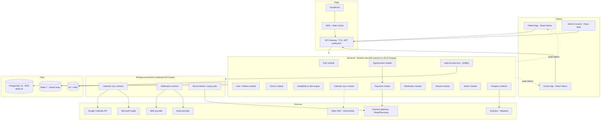
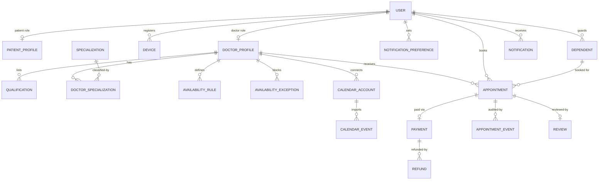
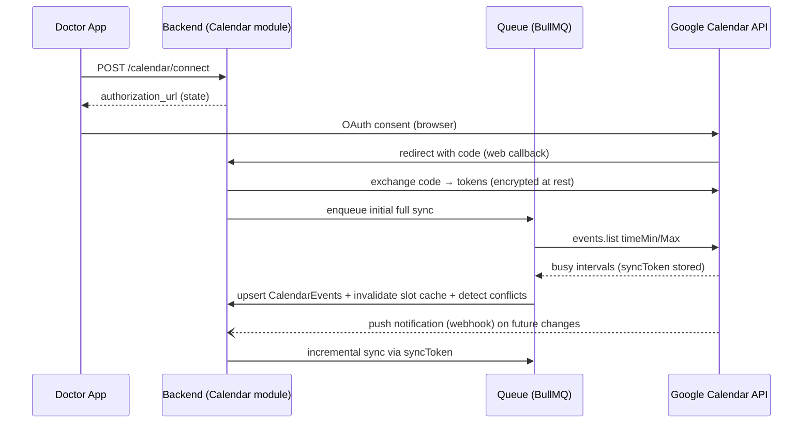
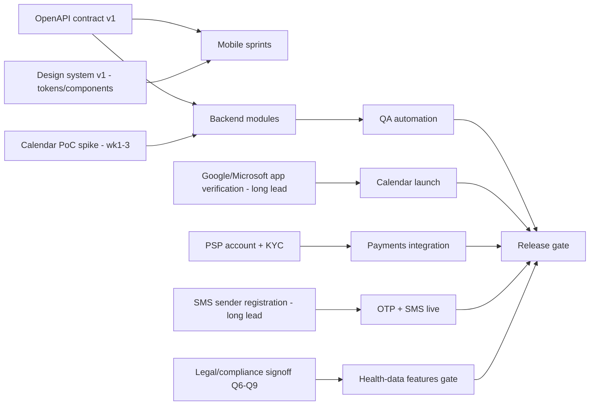

# MediBook — Technical Requirements Document (TRD)

| | |
|---|---|
| **Product** | MediBook — Doctor Consultation & Appointment Platform (working title) |
| **Version** | 1.0 Draft |
| **Date** | 2026-09-14 |
| **Owner** | Engineering Lead / Solution Architect (assign) |
| **Audience** | Solution Architects · Backend Engineers · React Native Engineers · DevOps · QA |
| **Companion** | [PRD.md](./PRD.md) · [Executive Summary](./README.md) |

---

## 1. Technical Overview

### 1.1 System purpose
Support two React Native mobile applications (Patient, Doctor) and an Admin web console with a shared backend that provides authentication, discovery, availability, **concurrency-safe appointment booking**, payments/refunds, calendar synchronization (Google, Outlook; ICS in Phase 2), notifications, and operational tooling — engineered so that security, privacy, reliability, appointment accuracy, and **prevention of double-booking** are structural properties, not features.

### 1.2 Architecture approach
- **Modular monolith** backend (NestJS, TypeScript) with strictly enforced module boundaries and an internal event bus; extraction-ready seams for later service splits (§18).
- **Contract-first API** — OpenAPI 3.1 published before mobile Sprint 1; generated typed clients shared via monorepo package.
- **PostgreSQL as the source of truth** for booking integrity (ACID, partial unique indexes, row locking); **Redis** for short-lived slot holds, caching, and job queues.
- **UTC-everywhere** time model with IANA timezones; DST handled by server-side expansion.
- **Event-driven side effects** (notifications, analytics, cache invalidation) so the request path stays simple and fast.

### 1.3 High-level architecture
Patients and doctors use React Native apps; ops staff use a React web console. All clients hit one versioned REST API through an API gateway (WAF + rate limiting). The backend is a single deployable containing domain modules; background workers consume queues for calendar sync, notifications, and reconciliation.

*(Diagram in §3.)*

### 1.4 PRD ↔ TRD traceability

| PRD domain (PRD §9) | Primary TRD coverage |
|---|---|
| PAT (account/profile) | §8 Auth, §6 DB, §7 API |
| DOC (onboarding/profile/schedule) | §5 Services, §6 DB, §7 API, §4 (Doctor app) |
| APT (appointment engine) | §10 Slot & booking engine, §6 DB, §7 API |
| CAL (calendar) | §9 Calendar integration architecture |
| NOT (notifications) | §11 Notification architecture |
| PAY (payments/refunds) | §5 (payment module), §10.6 (consistency), §14 (failure handling) |
| REV (reviews) | §6 DB, §7 API |
| ADM (admin console) | §5 (admin module), §8 (RBAC), §12 (audit) |
| PRD §13 business rules | §10.7 rules engine mapping |
| PRD §14 edge cases | §14 error handling, §10, §9.6 |
| PRD §16 NFRs | §13 performance, §17 observability, §18 scalability |

---

## 2. Recommended Technology Stack

| Layer | Choice | Why (and alternatives) |
|---|---|---|
| Mobile framework | **React Native 0.76+ with Expo SDK (development builds)**, TypeScript 5.x | One codebase, two apps; Expo gives OTA updates (EAS Update), build automation, and native-module escape hatches. Bare RN possible but slower to operate. New Architecture enabled. |
| Mobile navigation | **Expo Router** (file-based, typed routes) | Co-locates routes with screens, deep links map naturally; React Navigation 7 underneath. |
| Mobile state | **TanStack Query v5** (server state) + **Zustand** (client state) | Server-state caching/invalidation is the app's dominant problem; Zustand keeps local UI state tiny and testable. Avoid Redux unless team mandates it. |
| Forms & validation | **react-hook-form + Zod** | Shared Zod schemas with backend validation model (contract alignment); perf-friendly re-renders. |
| Secure storage | **expo-secure-store** (Keychain/Keystore) | Tokens and PII-ish prefs never in AsyncStorage. |
| Design system | **Custom token-based library** in monorepo (`packages/ui`) on RN core + Reanimated + Zeego/menu primitives | The design is custom (per brief); a thin in-house system (tokens → primitives → components) beats adopting a heavyweight kit. Storybook for web preview. |
| i18n | **i18next + react-i18next**, ICU messages | Localization-ready (PRD X10), RTL-safe. |
| Push | **expo-notifications** over FCM/APNs | Unified API; direct FCM/APNs acceptable later. |
| Backend runtime | **Node.js 20 LTS + NestJS 10 (TypeScript)** | Same language across stack; Nest's module/DI system enforces the modular-monolith boundaries; first-class OpenAPI via decorators. Fastify adapter for throughput. |
| API style | **REST (OpenAPI 3.1), versioned `/v1`** | Mobile-friendly, cacheable, easy gateway policies. GraphQL deferred — BFF complexity isn't justified at MVP scale. |
| ORM / DB | **Prisma + PostgreSQL 16** | Productive, typed, migrations-as-code; raw SQL escape hatch for the locking-critical booking transaction (§10). |
| Cache/locks/queues | **Redis 7 + BullMQ** | Slot holds (atomic SET NX), availability cache, notification/sync queues with delayed jobs and retries. |
| Auth | **Self-hosted JWT auth service module** (access 15 min + rotating refresh 30 d, hashed at rest), OTP via SMS/email providers; admin MFA (TOTP) | Full control of healthcare-grade session policy; avoids vendor lock-in. (Alternative: Auth0/Cognito — rejected for healthcare data-flow control & cost at scale.) |
| Cloud | **AWS**: ECS Fargate, RDS PostgreSQL (Multi-AZ), ElastiCache Redis, S3 + CloudFront, SES, Secrets Manager, KMS, WAF, VPC | Managed, healthcare-vetted, BAA-eligible (confirm Q7). GCP equivalent fine if preferred (Q10). IaC: **Terraform**. |
| File storage | **S3** (private buckets, presigned URLs) + CloudFront | License docs, avatars, receipts; server-side encryption KMS. |
| Email | **Postmark** (transactional) or SES | Deliverability + templates; SES for cost at scale. |
| SMS/OTP | **Twilio** or **MSG91** (market-dependent), provider abstraction | DLT registration lead time in India (TRD §20). |
| Video | **100ms** or **Daily.co** (managed WebRTC SDK) | RN SDKs, adaptive bitrate, recording off by default; BAA availability gates choice (Q12). |
| Payments | **Stripe** (global) / **Razorpay** (India) behind a thin payment-port interface | Market decision Q11; the port keeps the booking engine provider-agnostic. |
| Calendar integrations | **Google Calendar API v3** (webhooks + sync tokens), **Microsoft Graph v1.0** (subscriptions + delta), **node-ical** for ICS parsing | §9 details; provider adapters behind a common interface. |
| Analytics product events | **Mixpanel** (or Amplitude) via server-side event collector | Funnel KPIs (PRD §15) without PII; warehouse export Phase 2. |
| Error tracking | **Sentry** (both apps + backend) | Release health, source maps, app-store crash triage. |
| Monitoring/logging | **OpenTelemetry → Grafana stack** (Prometheus, Loki, Tempo) or **Datadog** (if budget prefers all-in-one) | RED/USE dashboards, traces across booking path, log redaction pipeline (§12.10). |
| Admin console | **React 18 + Vite + TypeScript + Ant Design** | Data-dense ops UI (tables, forms) fast to build; not user-facing, so heavyweight kit acceptable. |
| CI/CD | **GitHub Actions + EAS Build/Submit + Docker + Terraform Cloud** | §16. |
| Feature flags | **Flagsmith / AWS AppConfig** | ADM-011 policy knobs + launch toggles. |

---

## 3. System Architecture



Request-path principles:
1. Reads (availability, discovery) served from Postgres + Redis cache; never from stale-only caches without booking-time re-validation.
2. Writes (booking) are short transactions guarded by unique constraints and row locks (§10).
3. Everything asynchronous (emails, SMS, sync, analytics) goes through BullMQ queues with retries — the API never blocks on third parties.
4. Video tokens and payment intents are minted server-side; clients never hold provider secrets.

---

## 4. Application Architecture (React Native)

### 4.1 Monorepo layout (Turborepo + pnpm)
```
apps/
  patient/          # Patient app (Expo)
  doctor/           # Doctor app (Expo)
  admin-web/        # Admin console (React + Vite)
services/
  api/              # NestJS modular monolith
packages/
  ui/               # Design system: tokens, primitives, components (RN + web-compatible core)
  api-client/       # Generated OpenAPI client + TanStack Query hooks
  core/             # Shared domain types, Zod schemas, date/tz utilities, constants
  config/           # ESLint, TS config, env schema
```
Shared `core` owns the time/timezone utilities (§10.3) — a single implementation used by both apps prevents the classic "wrong timezone" bug class.

### 4.2 Navigation map
- **Patient:** auth stack (onboarding, OTP) → main tabs (Home, Discover, Appointments, Alerts, Profile) → modal flows (booking sheet, payment, reschedule, dependent editor) → deep links (`medibook://appointment/:id`, universal links for reminders).
- **Doctor:** auth stack → onboarding stack (verification wizard) → main tabs (Today, Appointments, Schedule, Patients, Profile) → modals (slot picker, leave/block editor, calendar connect).
- **Admin web:** route-based (Ant Pro-style layout), MFA gate.

### 4.3 State management
- **Server state (TanStack Query):** doctors list, doctor detail, availability per (doctor, type, week), appointments lists, notifications. Query keys encode tz and freshness; availability queries carry `staleTime: 30s` and always refetch on booking sheet focus.
- **Client state (Zustand):** session (user, role, verified status), booking draft (selected doctor/slot/dependent/type), feature flags, locale.
- **Form state:** react-hook-form + Zod resolvers generated from shared schemas.

### 4.4 API service layer
`packages/api-client` generated from OpenAPI → typed functions + Query hooks; **idempotency keys** auto-attached to all POST booking/payment calls (UUID persisted per draft); axios/fetch client with: auth header injection, 401 → silent refresh (single-flight), retry policy (idempotent GETs ×2 backoff; POSTs never blind-retried), request cancellation on navigation, and offline detection surfacing a global banner.

### 4.5 Authentication & token handling
OTP flow (§8) yields short-lived access token in memory + refresh token in **SecureStore** (Keychain/Keystore, device-biometric-gated optional). Refresh rotation with reuse-detection. Logout wipes tokens and Query cache. Role/verification state travels in token claims + is re-verified server-side per request (never trusted client-side).

### 4.6 Local storage & offline
- AsyncStorage/MMKV for non-sensitive cache (last availability responses, appointment list snapshots) → screens render cached data instantly with freshness chips (X8).
- **Offline reads** MVP; **offline writes** Phase 2 (queue with server re-validation on flush — booking/reschedule are never auto-replayed blindly).
- Screen-level skeletons + retry affordances; the booking sheet **requires connectivity** by design (integrity over convenience).

### 4.7 Error handling & UX patterns
- Central API error mapper (TRD §14 codes) → toast/screen-state decisions in one place.
- Booking errors are **specific** ("slot just taken — nearest alternatives") per PRD EC-04.
- Sentry with breadcrumbs; PII scrubbing on (§12.10).

### 4.8 Design system integration
`packages/ui` exposes tokens (color, type, spacing, radius, motion) + primitives (Button, Field, Sheet, Calendar strip, SlotGrid, AppointmentCard…) consumed by both apps; theming via light/dark tokens; dynamic type + accessibility props enforced in primitives (PRD §16). SlotGrid and timezone labels are single shared components — consistency is structural.

### 4.9 Performance budget (mobile)
Cold start < 3 s mid-tier Android; interaction < 100 ms on tab switches; list virtualization (FlashList); images via optimized CDN variants; Hermes enabled; bundle-size CI budgets.

---

## 5. Backend Architecture

### 5.1 Modular monolith (recommended for MVP — rationale)
- The booking path (availability → hold → payment → appointment → notifications) is a **single transactional story**; splitting it into networked microservices at MVP multiplies failure modes exactly where correctness matters most.
- One deployable + separate worker tasks keeps ops simple for a small team; NestJS module boundaries + enforced dependency rules (eslint boundaries) keep extraction cheap later (§18).
- Scale-out at MVP is horizontal instances behind the gateway + read replicas + queue workers — no re-architecture.

### 5.2 Modules (single deployable, separate worker processes for queues)

| Module | Responsibilities |
|---|---|
| **Auth** | OTP issue/verify, JWT mint/rotate/revoke, device sessions, admin MFA, rate limiting hooks |
| **Users / Patients** | Profiles, dependents, preferences, deletion workflow |
| **Doctors** | Registration, verification state machine, profile, consultation config, policy settings (DOC-007) |
| **Availability** | Templates, exceptions, slot expansion (pure domain service), availability cache invalidation |
| **Calendar** | Provider adapters (Google, Microsoft, ICS-P2), token vault, webhooks, sync jobs, busy-time model, conflict detection events |
| **Appointments** | Holds, booking transaction, reschedule/cancel/no-show/complete, status machine, idempotency |
| **Payments** | Gateway port (Stripe/Razorpay adapters), intents/captures/refunds, webhook ingestion, receipts, reconciliation |
| **Notifications** | Template rendering, channel adapters (push/email/SMS), preferences, quiet hours, delivery tracking |
| **Reviews** | Submission, moderation state, aggregates |
| **Admin** | Verification queue, management endpoints, config knobs, audit log service |
| **Analytics** | Server-side event collector → provider/warehouse; PII screening |

Cross-cutting: event bus (module events via BullMQ), audit-log interceptor, OpenAPI generation, health checks, feature flags.

### 5.3 Workers (separate ECS tasks consuming Redis queues)
`calendar-sync` (webhook + poll), `notifications` (immediate + delayed reminders), `reconciliation` (payment/appointment consistency sweep, hold expiry, refund retries), `analytics` flusher, `maintenance` (cache hygiene, token cleanup).

### 5.4 External service contracts
Every third party sits behind an adapter/port interface (`CalendarProvider`, `PaymentGateway`, `SmsProvider`, `EmailProvider`, `VideoProvider`) with: timeout budgets, circuit breakers, sandbox/mode toggles, and recorded failure modes feeding §14. This is what makes provider swaps (Q11/Q12) non-events.

## 6. Database Design

PostgreSQL 16 via Prisma (raw SQL for the booking-critical transaction). **All timestamps `timestamptz` in UTC; every user-facing entity stores an IANA timezone.** Soft deletes where compliance requires retention skeletons.

### 6.1 Conceptual ERD



### 6.2 Entity dictionary (key fields)

| Entity | Key fields (beyond id/created_at/updated_at) | Notes |
|---|---|---|
| **User** | role (`patient/doctor/admin`), phone_e164 (unique, nullable), email (unique-nullable, verified flags), status (`active/suspended/deleted`), locale, default_timezone, auth refs | Single identity table; role-specific data in profile tables |
| **PatientProfile** | user_id (PK/FK), display_name, dob, gender, photo_key, emergency_contact | PII-minimized; photo stored as S3 key |
| **Dependent** | guardian_user_id FK, name, relationship, dob, gender, notes, is_active | Bookings reference dependent_id nullable |
| **DoctorProfile** | user_id FK, display_name, bio, photo_key, experience_years, languages[], registration_number, council, country, verification_status (`pending/under_review/approved/rejected/suspended`), verified_at, clinic_address, clinic_geo, clinic_timezone, fee_currency, go_live_at | Licensed fields trigger re-review on change (PRD R10) |
| **Qualification** | doctor_id FK, degree, institution, year, document_key | |
| **Specialization** | name, slug (unique), icon, is_active | Admin catalog (ADM-006) |
| **DoctorSpecialization** | doctor_id, specialization_id, is_primary | |
| **AvailabilityRule** | doctor_id, weekday (0–6), start_local_time, end_local_time, slot_minutes, buffer_minutes, consult_types[], effective_from | Weekly template in **clinic-local wall time** (DST-safe expansion §10.3) |
| **AvailabilityException** | doctor_id, start_utc, end_utc, kind (`leave/block`), reason | Overrides rules |
| **CalendarAccount** | doctor_id, provider (`google/microsoft/ics`), account_email, status (`connected/error/revoked/expired`), token_ciphertext, token_iv, sync_cursor, last_synced_at, timezone | Tokens encrypted (§12.4); never logged |
| **CalendarEvent** | calendar_account_id FK, external_id, start_utc, end_utc, is_busy, provider_status, fingerprint | **No titles/attendees stored** (PRD CAL-008); unique (account_id, external_id) |
| **Appointment** | code (human), patient_user_id FK, dependent_id nullable, doctor_id FK, consult_type, start_utc, end_utc, doctor_timezone, status (`held/pending_approval/confirmed/in_progress/completed/cancelled/no_show/rescheduled`), cancelled_by, cancel_reason, reschedule_of_id self-FK, payment_id, source_note | **Partial unique index** below |
| **AppointmentEvent** | appointment_id, from_status, to_status, actor_type/actor_id, reason, metadata | Immutable status audit |
| **Payment** | appointment_id, provider, provider_ref, amount_minor, currency, status (`initiated/authorized/captured/failed/refunded`), receipt_url, raw_event_id | Amounts in minor units |
| **Refund** | payment_id, amount_minor, reason, status (`initiated/processing/completed/failed`), actor | Idempotent via provider_ref |
| **Review** | appointment_id (unique), doctor_id, patient_user_id, rating 1–5, comment, status (`published/hidden`), moderated_by | |
| **Notification** | user_id, type, channel, title, body, payload, status (`queued/sent/delivered/failed/read`), sent_at, read_at | Delivery tracking (§11.7) |
| **NotificationPreference** | user_id, category, push/email/sms booleans, quiet_hours | |
| **Device** | user_id, platform, push_token, last_seen_at | Token rotation friendly |
| **AuditLog** | actor_type/actor_id, action, entity_type/entity_id, before/after (JSONB), ip, user_agent | Append-only; no updates |
| **IdempotencyKey** | key (unique), user_id, endpoint, status, response_snapshot | 24h TTL cleanup |
| **Hold** | patient_user_id, doctor_id, slot_start_utc, slot_end_utc, consult_type, expires_at, status (`active/released/expired/converted`) | Also backed by Redis for fast checks |
| **PlatformConfig** | key, value JSONB, updated_by | PRD §13 knobs |
| **AnalyticsEvent** | name, actor_pseudonymous_id, properties JSONB, occurred_at | Batched to provider |

### 6.3 Integrity-critical constraints

```sql
-- The double-booking killer: only ONE active appointment per doctor per slot start
CREATE UNIQUE INDEX ux_appointments_doctor_slot
  ON appointments (doctor_id, start_utc)
  WHERE status IN ('held','pending_approval','confirmed','in_progress');

-- One active hold per patient
CREATE UNIQUE INDEX ux_holds_active_patient
  ON holds (patient_user_id) WHERE status = 'active';

-- One review per completed appointment
CREATE UNIQUE INDEX ux_review_appointment ON reviews (appointment_id);
```

Booking commits run in a transaction that (a) `SELECT … FOR UPDATE` on the doctor's appointment range row-set or relies on the partial unique index as the final arbiter, and (b) re-checks external busy time. See §10.

---

## 7. API Requirements

### 7.1 Conventions
- REST, base `/v1`, JSON, TLS-only. Version in path; additive changes only within a version.
- **Auth:** `Authorization: Bearer <access JWT>`; anonymous endpoints marked below.
- **Idempotency:** all POSTs that create money/slot state require `Idempotency-Key` header (UUID), honored 24 h.
- **Pagination:** cursor-based (`?limit=20&cursor=…`) returning `meta.next_cursor`.
- **Time:** request/response times are ISO-8601 UTC; clients pass `?tz=Asia/Kolkata` for localized availability rendering; all responses include `doctor_timezone` where relevant.
- **Error envelope:**
```json
{ "error": { "code": "APT_SLOT_TAKEN", "message": "That slot was just taken.", "details": { "alternatives": ["…start times…"] }, "trace_id": "…" } }
```

| HTTP | Usage |
|---|---|
| 200 OK / 201 Created | Success |
| 400 VAL_INVALID | Schema/validation failure |
| 401 AUTH_REQUIRED / AUTH_TOKEN_EXPIRED | Auth problems |
| 403 AUTHZ_FORBIDDEN (e.g., doctor not verified) | Permissions |
| 404 NOT_FOUND | Existence |
| 409 APT_SLOT_TAKEN / APT_HOLD_ACTIVE / APT_STATE_CONFLICT | Booking races & state machine violations |
| 410 APT_SLOT_EXPIRED / APT_SLOT_PAST | Holds & windows |
| 422 PAY_FAILED / CAL_* / DOC_NOT_VERIFIED | Domain rejections |
| 429 RATE_LIMITED | Throttling |
| 500 SYS_INTERNAL | Unexpected (alert) |

### 7.2 Endpoint catalog

**Auth**
| Method & path | Auth | Purpose |
|---|---|---|
| `POST /auth/otp/request` | anon | Send OTP to phone/email |
| `POST /auth/otp/verify` | anon | Verify OTP → tokens (+ create account on `register=true`) |
| `POST /auth/refresh` | refresh token | Rotate tokens |
| `POST /auth/logout` | user | Revoke current session |
| `GET /auth/me` | user | Session identity + role + verification status |

**Patients / profile**
| `GET/PATCH /patients/me` · `GET/POST/PATCH/DELETE /patients/me/dependents` · `PATCH /patients/me/preferences` · `POST /patients/me/deletion-request` | user |

**Doctors (public discovery + self management)**
| Method & path | Auth | Purpose |
|---|---|---|
| `GET /doctors` | anon | Search/filter/sort/paginate listings |
| `GET /doctors/{doctorId}` | anon | Public profile (verified fields only) |
| `GET /doctors/{doctorId}/availability?tz=&from=&to=&type=` | anon | Expanded slots + freshness metadata |
| `GET/PATCH /doctor/me/profile` | doctor | Professional profile |
| `PUT /doctor/me/verification` | doctor | Submit/refresh verification documents |
| `GET/PUT /doctor/me/consultation-config` | doctor | Types, fees, durations |
| `GET/POST/PATCH/DELETE /doctor/me/availability/rules` · `/exceptions` | doctor | Templates & blocks |
| `GET/PUT /doctor/me/policy` | doctor | DOC-007 knobs |

**Appointments**
| Method & path | Auth | Purpose |
|---|---|---|
| `POST /appointments/holds` | patient | Create 5-min hold on a slot |
| `DELETE /appointments/holds/{holdId}` | patient | Release early |
| `POST /appointments` | patient | Book (from hold or inline; idempotent) |
| `GET /appointments?scope=upcoming/past&member=` | patient/doctor | Role-scoped lists |
| `GET /appointments/{id}` | participant | Detail |
| `PATCH /appointments/{id}` | participant | **Reschedule** (`{start_utc}`) — validated against PRD §13 R3 |
| `DELETE /appointments/{id}` | participant/admin | **Cancel** (soft; idempotent; reason body) |
| `POST /appointments/{id}/complete` · `/no-show` | doctor | Terminal actions |
| `POST /appointments/{id}/accept` · `/decline` | doctor | Manual-approval mode |
| `POST /appointments/{id}/join-token` | participant | Mint video SDK token (window-gated) |
| `POST /appointments/{id}/review` | patient | Post-completion review |

**Calendar (doctor)**
| `POST /calendar/connect` (returns provider OAuth URL + state) · `GET /calendar/status` · `POST /calendar/sync` (manual) · `DELETE /calendar/accounts/{accountId}` · `POST /calendar/callback/{provider}` (OAuth redirect target, web) |

**Payments**
| `POST /payments/intent/{appointmentId}` (gateway order/token for checkout sheet) · `POST /payments/webhook/{provider}` (gateway-signed, anon) · `GET /payments/{id}/receipt` |

**Notifications**
| `GET /notifications` · `POST /notifications/{id}/read` · `GET/PUT /notifications/preferences` · `POST /devices` (register push token) |

**Admin** (`/admin/*`, role-gated)
| `GET /admin/verification-queue` · `POST /admin/doctors/{id}/verify` (approve/reject+reason) · `POST /admin/doctors/{id}/suspend|reinstate` · `GET /admin/patients` · `POST /admin/patients/{id}/deactivate` · `GET /admin/appointments` · `POST /admin/appointments/{id}/cancel` · `GET /admin/refunds` + `POST /admin/refunds/{id}/execute` · CRUD `/admin/specializations` · `GET /admin/reports/*` · `GET /admin/audit-logs` · `GET/PUT /admin/config` |

### 7.3 Detailed specs — key endpoints

#### 7.3.1 `POST /auth/otp/request` (anon)
Request: `{ "channel": "phone" | "email", "destination": "+9198…", "purpose": "login" | "register" }`
Validation: E.164 phone or RFC email; per-destination rate limit (5/hour) and per-IP limits.
Response `204` (no content) with generic success regardless of account existence (enumeration defense). Errors: `429 RATE_LIMITED`.
SMS text never contains "MediBook account" wording beyond policy; code valid 10 min, 3 attempts.

#### 7.3.2 `POST /auth/otp/verify` (anon)
Request: `{ "channel": "phone", "destination": "+9198…", "code": "123456", "role": "patient" | "doctor", "register": true, "profile_draft": { "display_name": "Priya" } }`
Behavior: verify code → create user (if `register`) → mint access (15 min) + refresh (30 d, stored hashed, device-bound). Response `201`: `{ "access_token", "expires_in", "refresh_token", "user": { "id", "role", "onboarding_state" } }`.
Errors: `422 AUTH_OTP_INVALID`, `410 AUTH_OTP_EXPIRED`, `423 AUTH_LOCKED` (attempts exceeded → 60 s cooldown).

#### 7.3.3 `GET /doctors/{doctorId}/availability?tz=Asia/Kolkata&from=2026-09-20&to=2026-09-26&type=video` (anon)
Response `200`:
```json
{
  "doctor_id": "doc_123", "consult_type": "video",
  "doctor_timezone": "Asia/Kolkata",
  "generated_at": "2026-09-14T10:00:00Z",
  "calendar_sync": { "connected": true, "last_synced_at": "2026-09-14T09:58:12Z", "staleness": "PT2M" },
  "days": [{
    "date": "2026-09-20", "slots": [
      { "start_utc": "2026-09-20T04:30:00Z", "end_utc": "2026-09-20T04:45:00Z",
        "local_start": "2026-09-20T10:00:00+05:30", "status": "available", "fee_minor": 50000, "currency": "INR" }
    ]
  }]
}
```
Note `calendar_sync.staleness` powers the PRD freshness UX (X3). Errors: `404 NOT_FOUND` (never expose unverified doctors).

#### 7.3.4 `POST /appointments` (patient, idempotent)
Request:
```json
{
  "hold_id": "hold_9f2",              
  "doctor_id": "doc_123", "consult_type": "video",
  "start_utc": "2026-09-20T04:30:00Z",
  "dependent_id": null,
  "note": "Skin rash on forearm",
  "payment": { "method": "gateway_token", "gateway_token": "pm_…" }
}
```
Validation: hold ownership & TTL; slot re-check (uniqueness + external busy); doctor live & verified; patient booking-window rules (PRD R1, R14); fee consistency.
Flow: within one DB transaction → convert hold → insert appointment (`confirmed` or `pending_approval`) → `FOR UPDATE` arbitration via partial unique index → create payment record → commit → emit events (notifications, analytics, cache invalidation) → return.
Response `201`:
```json
{ "appointment": { "id": "apt_771", "code": "MB-8H2K4", "status": "confirmed",
    "start_utc": "2026-09-20T04:30:00Z", "end_utc": "2026-09-20T04:45:00Z",
    "doctor_timezone": "Asia/Kolkata", "payment": { "status": "captured", "receipt_url": "…" } } }
```
Errors: `409 APT_SLOT_TAKEN` (with `alternatives[]`), `410 APT_HOLD_EXPIRED`, `422 CAL_SLOT_CONFLICT` (external busy appeared), `402 PAY_FAILED` (with gateway reason), `422 DOC_NOT_VERIFIED`.

#### 7.3.5 `PATCH /appointments/{id}` (participant — reschedule)
Request: `{ "start_utc": "2026-09-22T05:00:00Z" }` — server validates policy (R3), creates atomic move in one transaction (§10.5), returns updated appointment. Errors: `409 APT_STATE_CONFLICT` (concurrent change), `422 APT_RESCHEDULE_LIMIT`, `409 APT_SLOT_TAKEN`.

#### 7.3.6 Calendar endpoints (doctor)
`POST /calendar/connect` → `{ "provider": "google" }` returns `{ "authorization_url": "https://accounts.google.com/o/oauth2/...state=…" }` (state = signed, doctor-bound, 10-min TTL). OAuth redirect lands on a web callback which deep-links back into the app.
`GET /calendar/status` → per-account: `{ "provider", "email", "status", "last_synced_at", "busy_events_90d": 142, "conflicts_open": 1 }`.
`POST /calendar/sync` → triggers priority job; returns `{ "queued": true, "job_id" }` (result via push/notification). `DELETE /calendar/accounts/{id}` → deletes tokens + derived events (audited), invalidates availability cache.

---

## 8. Authentication & Authorization

### 8.1 Identity flows
- **Patients/Doctors:** phone-first OTP (SMS provider), email OTP as fallback/recovery; registration captures role; role is immutable post-registration (separate apps).
- **Admins:** email+password (argon2id) + **TOTP MFA mandatory**; password policy (≥12 chars, breach-list checked); lockout with exponential backoff.
- **Account recovery:** email OTP re-binding flow; support-assisted identity verification script for lost access (documented, audited).

### 8.2 Token & session model
| Token | Lifetime | Storage | Notes |
|---|---|---|---|
| Access JWT | 15 min | Memory only | Claims: `sub, role, verification_state, jti` |
| Refresh token | 30 days, **rotated on every use** | Hashed in DB; device-bound | Reuse of a rotated token → **revoke entire token family** (theft signal) |
| OAuth provider tokens (calendar) | Per provider | KMS-encrypted column (§12.4) | Never leaves server except to provider API |
| Video room token | 10 min, appointment-scoped | Minted on demand | Window-gated (APT-009) |

Session policies: max 5 active devices/user (oldest evicted, user notified); admin sessions 30-min idle timeout; all sessions listable + revocable (P2 UI, API now).

### 8.3 RBAC matrix (enforced server-side per route + per record)
Roles: `patient`, `doctor`, `admin:support`, `admin:ops`, `admin:finance`, `admin:super`. Record-level checks: appointment participants only; doctor sees only own profile/appointments and only patient context of own visits (PRD DOC-015); admin PII visibility masked by default with purpose-ful unmask (logged). Doctor routes additionally require `verification_state=approved` for anything that affects public availability.

### 8.4 Hardening
OTP brute-force limits; OTP never usable as password; enumeration-safe responses; device binding on refresh; JWT `aud`/`iss` pinned; clock-leeway 30 s; webhook signature verification for payments (PSP) and calendar push; admin actions require reason payloads where PRD demands (ADM-005).

## 9. Calendar Integration Architecture

### 9.1 Provider matrix & scopes

| Provider | API | Scope requested | Change detection | Window |
|---|---|---|---|---|
| Google | Calendar API v3 | `https://www.googleapis.com/auth/calendar.events.readonly` (busy/free derivation) | Push **watch channels** + `syncToken` incremental sync | now−7 d → +90 d |
| Microsoft | Graph v1.0 | `Calendars.Read` (application of busy/free via `calendarView`) | Graph **subscriptions** (webhooks) + **delta** queries | now−7 d → +90 d |
| ICS (Phase 2) | HTTPS fetch of `.ics` | none (URL is a secret) | `ETag`/`Last-Modified` polling ≤30 min | now → +90 d |

Privacy invariant: adapters extract **only** `{start, end, busy/transp, status}`; titles/attendees/descriptions are discarded at ingestion (PRD CAL-008). All-day events and `transp: opaque` events count as busy; `free`/`transparent` and cancelled events do not.

### 9.2 OAuth flow (mobile)
1. Doctor taps Connect (Doctor App) → `POST /calendar/connect` → backend returns provider `authorization_url` with signed `state` (doctor-bound, 10-min TTL, single-use) and PKCE where supported.
2. App opens system browser / ASWebAuthenticationSession (never a WebView for OAuth).
3. Provider redirects to backend web callback → backend exchanges `code` for tokens (server-side client secret) → encrypts tokens → creates `CalendarAccount` → enqueues initial full sync → redirects to a lightweight page that deep-links back into the app (`medibook://calendar/connected?account=…`).
4. Errors surface as deep-link states (`denied`, `expired`, `error`) with retry guidance.

### 9.3 Synchronization model
- **Initial sync:** full fetch of window via `calendarView` (MS) / `events.list` with `timeMin/Max` (Google) → upsert `CalendarEvent` rows → invalidate affected availability cache keys → compute conflicts against existing appointments → emit conflict events.
- **Incremental:** Google `syncToken` (stored per account); MS delta links. Webhook push (`Google: watch channel renewal ≤ 7 d; MS Graph subscription lifecycle`) enqueues high-priority sync jobs with **dedup** (same account+resource within 30 s coalesced).
- **Poll fallback:** every account polled ≤15 min regardless of webhooks (webhooks are best-effort); ICS ≤30 min. A per-account `last_synced_at` powers staleness UX and monitoring alerts (sync lag > 30 min → alert).
- **Renewal jobs:** daily job renews watch channels/subscriptions before expiry; failure → error state + doctor notification.

### 9.4 Conflict detection pipeline
On every sync diff: for each busy interval, find overlapping appointments (`status IN active set`) → if found and not already flagged: attach conflict to appointment + notify doctor (PRD EC-03; never auto-cancel). For unbooked slots: no action needed — the slot expansion simply excludes busy intervals. Conflicts auto-clear when the busy event disappears/changes on a later sync.



### 9.5 Token security & lifecycle
AES-256-GCM envelope encryption via KMS; per-account data keys; plaintext never in logs or memory dumps beyond request scope; refresh on 401 with single-flight; repeated auth failure → account `error/expired` + doctor alert; **provider-side revoke detection** (Google: tokeninfo / 401; MS: 401 + `ConsistencyLevel` checks) → status `revoked` → slots recomputed (busy time no longer subtracted) + reconnect notification.

### 9.6 Failure recovery
| Failure | Behavior |
|---|---|
| Webhook missed | Poll converges ≤15 min; staleness label reflects reality |
| Provider 5xx / rate limit | Exponential backoff (BullMQ), circuit breaker per provider, last-known-good retained |
| Sync job crash | Job idempotent (upserts keyed by external_id) — safe retry |
| Malformed ICS (P2) | Keep last-good, mark account error, alert |
| Timezone of events | Each event's own tz honored → UTC; ICS `VTIMEZONE` handled by parser |

### 9.7 iCalendar/Apple positioning (Phase 2)
iCloud offers no public OAuth for third-party busy reads; the supported pattern is a **published/read-only ICS subscription URL** (Apple Calendar → share public calendar). Documented for users; treat URL as a credential (encrypted, rotatable).

---

## 10. Appointment & Slot Engine

### 10.1 Slot generation (pure, deterministic)
```
slots(doctor, type, dateRange) =
  expand(AvailabilityRules, type)            // clinic-local wall time → UTC instants
  − AvailabilityExceptions                    // leaves & blocks
  − active appointments (held→in_progress)    // DB
  − busy CalendarEvents (union all accounts)  // derived set
  − buffer adjustments                         // per doctor config
  − policy filter (min notice, max horizon, R14)
```
Cached per `(doctor, type, day, tz-irrelevant)` in Redis with explicit invalidation on: rule/exception change, appointment write, calendar sync diff, policy change. Availability responses embed `generated_at` + `calendar_sync.last_synced_at` (freshness UX).

### 10.2 Slot hold & booking transaction (concurrency design)
```mermaid
sequenceDiagram
    participant P as Patient App
    participant API as Appointment module
    participant R as Redis
    participant DB as PostgreSQL
    participant PSP as Payment gateway

    P->>API: POST /appointments/holds (slot)
    API->>DB: validate slot still free (read)
    API->>R: SET hold:{doctor}:{start} NX EX 300
    API->>DB: insert hold row (partial unique: 1 active hold/patient)
    API-->>P: hold_id + expires_at (countdown starts)

    P->>PSP: checkout (gateway sheet)
    PSP-->>API: payment authorized (webhook / client return)
    P->>API: POST /appointments (hold_id, Idempotency-Key)
    API->>DB: BEGIN
    API->>DB: re-check slot: SELECT ... FOR UPDATE + partial unique index
    API->>DB: re-check external busy (calendar set)
    API->>DB: insert appointment(status=confirmed|pending_approval)
    API->>DB: hold → converted; commit
    API-->>P: 201 appointment
    API--)Q: notifications, analytics, cache invalidation
    Note over API,PSP: If capture pending → status held→authorized→confirmed via webhook reconciliation
```

**Layers of double-booking defense (any one failing does not break the guarantee):**
1. Redis hold `SET NX` — cheap early gate, visibility to other readers.
2. Hold row partial-unique index — server-side truth independent of Redis.
3. Booking transaction: `SELECT … FOR UPDATE` on the slot range + **partial unique index** `ux_appointments_doctor_slot` (§6.3) — the DB is the final arbiter; violation → `409 APT_SLOT_TAKEN` + alternatives.
4. **Idempotency keys** — client retries after timeouts replay the same booking, never duplicate it.
5. Booking-time external-busy re-check — protects against stale availability cache (PRD EC-19).

Load test gate (§15, §21): 200 parallel `POST /appointments` on one slot across 20 pods → exactly 1×201, 199×409, 0 double-bookings, 0 phantom money.

### 10.3 Timezone & DST rules
- Storage: UTC `timestamptz` everywhere + `doctor_timezone` (IANA) on doctor/appointment.
- Weekly rules are **wall-clock in clinic tz** and expanded lazily (e.g., 90-day horizon re-expansion scheduled on IANA tzdata release news) — so a 10:00 appointment stays 10:00 across DST, not 09:00.
- Cross-check: appointments store both `start_utc` and the wall-clock rendering inputs; clients display per-viewer tz with explicit labels; ambiguous/nonexistent local times during DST shift resolved by server canonical rules (first occurrence / shift-forward) and logged.
- All comparison/window logic uses UTC instants; "local business day" grouping computed with the doctor's tz.

### 10.4 State machine enforcement
Transitions validated server-side by a single `AppointmentStateMachine` (§1 state diagram); illegal transitions → `409 APT_STATE_CONFLICT`. Every transition writes an `AppointmentEvent` row (immutable audit). Concurrency on the same appointment serialized via row-level lock (participants can't double-reschedule, PRD EC-11).

### 10.5 Reschedule & cancel internals
- **Reschedule:** one transaction: lock appointment → validate policy (R3) → create/convert hold on new slot (same defense layers) → update `start/end` (+ append change event) → release old slot (implicit via index) → emit notifications. Old reminders rescheduled; receipt unchanged unless fee delta → gateway incremental authorize.
- **Cancel:** idempotent soft cancel: lock → status→`cancelled` + actor/reason → free slot (index) → enqueue refund per policy matrix (R2) → cancel queued reminders → notify. Repeated DELETE replays same response (idempotent).

### 10.6 Payment↔booking consistency
Order of truth: **appointment row is authoritative; payment events reconcile to it.** All money endpoints idempotent; PSP webhooks verified + deduped by event id; nightly reconciliation job: (a) captured payments without active appointment → auto-refund + incident ticket; (b) appointments `confirmed` missing capture past grace (free/pending exceptions whitelisted) → flag + optional auto-cancel with notice; (c) refund statuses synced. Admin ops view exposes mismatches (ADM-008).

### 10.7 Business-rules engine
PRD §13 rules live in `PlatformConfig` + per-doctor `policy` (DOC-007), evaluated by the availability/booking domain services with a **single rules module** (testable pure functions); admin config edits are audited and hot-applied via flag service. No rule constants in code paths that tests can't see.

---

## 11. Notification Architecture

- **Queueing:** BullMQ queues per channel (`push`, `email`, `sms`) + delayed jobs for reminders (`T-24h`, `T-2h`, `T-10m`); a cron sweeper re-materializes reminders for appointments changed while jobs were pending (reschedule/cancel cancels queued jobs by key).
- **Rendering:** template service (locale-aware, parameterized, tz-correct); templates version-controlled in repo; variables whitelisted; no PII in push payload bodies beyond appointment code + time (lock-screen privacy).
- **Channels:** FCM/APNs (via expo-notifications server API), Postmark/SES, Twilio/MSG91 — each behind an adapter with timeout, retry (3× exponential), and circuit breaker.
- **Preferences & quiet hours:** evaluated at send time; critical classes (`cancellation`, `join_window`, `security`) bypass quiet hours and preference mutes (but not hard opt-outs where legally required — legal review Q6).
- **Delivery tracking:** provider webhooks (FCM error classes, Postmark events, Twilio status) update `Notification.status`; failures trigger fallback chain push→email→in-app for critical events; bounce/suppress lists maintained per channel.
- **Dedup & rate limiting:** per (user, event-id) dedup; per-user burst caps to prevent spam bugs; OTP has separate stricter limits.
- **Analytics:** delivery funnel (queued→sent→delivered→opened) dashboards; alert on backlog depth or failure rate > 2%.

---

## 12. Security

| Area | Requirement |
|---|---|
| **Transport** | TLS 1.2+ everywhere (client↔API, API↔providers); HSTS; modern cipher suite; certificate pinning optional P2 (with kill-switch) |
| **At rest** | RDS + S3 encrypted with KMS CMKs; automated backups encrypted; field-level envelope encryption for calendar OAuth tokens & other secrets (§9.5) |
| **Credentials** | argon2id for admin passwords; OTPs hashed + short TTL + attempt caps; no PANs ever touch our systems (gateway tokenization — SAQ-A scope target) |
| **Tokens** | §8.2 model; refresh rotation + family revocation; JWTs pinned aud/iss; signing keys in KMS, rotated quarterly |
| **OAuth (calendar)** | State/PKCE, minimal scopes (§9.1), server-side token vault, provider revoke handling, security-page guidance in-app |
| **API authorization** | Deny-by-default route guards; record-level checks (§8.3); object-id UUIDs (no enumerable ids); admin actions reason+audit enforced |
| **Rate limiting** | Edge (IP) + app-level (user/destination) tiers; strictest on OTP & booking writes; 429 with Retry-After |
| **Input validation** | Zod schemas shared client/server; Prisma parameterization; file uploads: type sniffing, size caps, EXIF strip, AV scan, private buckets + presigned reads |
| **Logging** | Structured logs with **PII redaction middleware** (phones, emails, tokens, event titles); request IDs for tracing; log retention 90 d (configurable) |
| **Audit trails** | Append-only `AuditLog` for auth events, admin actions, verification decisions, cancellations/refunds, config changes, calendar connect/disconnect; exportable (ADM-010) |
| **PII / health data** | Data inventory + minimization (PRD A5: no medical records at MVP); pseudonymous analytics; retention/deletion workflows (EC-26); **compliance obligations per market TBD Q6–Q8 — legal gate before launch, not assumed** |
| **Mobile hardening** | SecureStore tokens; screenshot-blur on sensitive screens; app-attest/Play Integrity (P2); no secrets in bundles; env config via compile-time injection |
| **Vulnerability management** | Dependency scanning (Dependabot + audit gate), SAST in CI, annual pen test, secrets scanning on repo |

---

## 13. Performance Requirements

| Metric | Target |
|---|---|
| API availability query p95 | < 300 ms |
| Search/listing p95 | < 500 ms |
| Booking commit (incl. payment authorize handshake) p95 | < 800 ms |
| Appointment writes p99 | < 1.5 s |
| App cold start (mid-tier Android / modern iPhone) | < 3 s / < 2 s |
| Slot hold acquisition | < 150 ms p95 |
| Calendar webhook → availability reflected | < 60 s p95 (poll path ≤ 15 min) |
| Push notification delivery p95 | < 30 s from event |
| Email/SMS p95 | < 2 min |
| Sustained load | 50 rps mixed / 500 rps peak reads without error-rate regression |
| Concurrency design point | 10k concurrent users, 200 parallel bookings on a single slot resolved correctly |
| Video join latency | < 3 s from token (vendor-dependent) |

Budgets enforced in CI (api-client generated types + k6 smoke) and alerting thresholds (§17).

---

## 14. Error Handling

Standard envelope (§7.1). Per-failure behavior:

| Failure class | Detection | System behavior | Client UX |
|---|---|---|---|
| Network loss | Client reachability | Nothing sent; holds keep TTL server-side | Offline banner; retry affordances; cached reads |
| Timeout on booking POST | Client | **Never blind-retry**; client checks `GET /appointments?code=` with idempotency key before re-post | "Checking your booking…" state |
| API 5xx | Server | Alert; circuit breakers on externals | Friendly retry; booking failures expose alternatives |
| Auth expiry | 401 | Silent refresh (single-flight); hard logout on refresh failure | Seamless; re-login screen |
| Booking conflict | 409 `APT_SLOT_TAKEN` | Alternatives returned | "Slot just taken" + nearest 3 slots (EC-04) |
| Hold expired | 410 | Hold row released | Re-select slot; payment never taken |
| Payment failure | 402/PSP webhook | Hold released after grace; reconciliation sweep | Clear failure reason; retry payment while hold alive |
| Paid-but-unbooked mismatch | Reconciliation job | Auto-refund + incident (§10.6) | Proactive apology email + refund notice |
| Calendar failure | Sync errors | Last-good + staleness + booking-time re-check | Freshness labels; doctor reconnect prompts |
| Video failure | Provider errors | Rejoin allowed; incident surfaced | Retry join; support path; compensation policy |
| Server failure / deploy | Health checks | Rolling deploy, auto-rollback (§16) | Brief degraded reads; writes fail-safe (no half states) |

Error taxonomy owned in one module; every new error code requires: docs entry, client mapping, dashboard tag.

## 15. Testing Strategy

| Level | Scope | Tooling | Gate |
|---|---|---|---|
| Unit | Slot expansion, policy rules, state machine, tz/DST utilities, refund calculator | Jest + shared `core` tests | ≥ 80% on domain modules; DST table-driven tests mandatory |
| Integration | Module + DB (testcontainers Postgres/Redis), webhook handlers, idempotency | Jest + Supertest | All PRD EC-* edge cases have an integration test |
| API contract | OpenAPI schema ↔ responses | Dredd/openapi-enforcer in CI | Contract drift fails build |
| Component (RN) | Booking sheet, SlotGrid, appointment cards | React Native Testing Library | Core flows snapshot + a11y assertions |
| E2E (mobile) | J1–J13 journeys on device farm | **Maestro** (or Detox), iOS + Android | Green on release candidates |
| E2E (web admin) | Verification queue, oversight flows | Playwright | Green on release candidates |
| **Concurrency** | N parallel bookings on one slot; parallel reschedules; hold expiry races | k6 + custom harness vs staging DB | **200 parallel → exactly 1 success; release-blocking** |
| Calendar integration | Google test project + MS test tenant: webhook, poll, conflict, revoke, DST, all-day events, recurring events | Dedicated sandbox suite run nightly | No drift > 15 min; conflict assertions |
| Payment integration | PSP sandbox: authorize/capture/refund, webhook dupes/out-of-order, chargebacks | Sandbox suite | Reconciliation zero-mismatch soak (48 h) |
| Security | SAST, dependency audit, secrets scan, OWASP API top-10 checks, pen test pre-launch | CI + external vendor | No P0/P1 open |
| Performance | Load profiles (§13), soak, spike | k6 + Grafana | p95 budgets met |
| Accessibility audit | Screen reader (VoiceOver/TalkBack), dynamic type, contrast | Manual + axe-style checks | Release-blocking for core flows |
| UAT | PRD acceptance criteria per requirement ID; ops rehearse J14–J16 | Staging + test markets | Sign-off in PRD App. C |

Test data: synthetic doctors/patients generator; anonymized staging snapshots prohibited for PII unless tokenized.

---

## 16. CI/CD & Deployment

- **Source control:** GitHub, trunk-based; conventional commits; PR checks = lint + typecheck + unit + contract tests + preview deploy of affected app.
- **Pipelines (GitHub Actions):**
  - *API:* build → test → OpenAPI diff gate → Docker image → ECR → staging (auto) → prod (manual gate) → ECS rolling deploy with health checks + auto-rollback; Terraform plan/apply with approval.
  - *Mobile:* EAS Build profiles (dev/preview/production) per app → Jest + Maestro on PR → internal distribution (TestFlight / Play Internal) → store submission via EAS Submit; **EAS Update** OTA for JS-only fixes (native changes still require store releases).
  - *Admin web:* build → Playwright → CloudFront/S3 deploy per environment.
- **Environments:** `dev` (ephemeral per-PR API where feasible), `staging` (prod-shaped, sandbox providers), `prod` (Multi-AZ). Provider keys segregated per environment; staging uses PSP/calendar sandboxes.
- **Database migrations:** expand→contract pattern; backward-compatible two-phase deploys; migrations run as gated pipeline step with lock + auto-cancel on failure.
- **Release strategy:** mobile staged rollout 10%→50%→100% with Sentry release-health gates; feature flags for risky surfaces (calendar write-back P2, policy changes).
- **Store operations:** privacy nutrition labels/data-safety forms maintained in repo; health-app policy pre-check (PRD §17); metadata per locale.

---

## 17. Observability

| Signal | Implementation |
|---|---|
| Traces | OpenTelemetry across API + workers; booking path traced end-to-end (hold→commit→notify) |
| Metrics | Prometheus: RED per endpoint; **business metrics**: bookings/min, booking-failure rate by code, hold-expiry rate, sync lag per account, payment-mismatch count, notification backlog |
| Logs | Structured JSON → Loki; PII redaction middleware; request-id correlation with client traces |
| Errors | Sentry (apps + backend) with release tagging and ownership rules |
| Dashboards | (1) Booking integrity, (2) Calendar sync health, (3) Payments reconciliation, (4) Notification funnel, (5) Infra USE |
| Alerts (paging) | Booking failure rate > 1% for 10 min · double-booking constraint violation (should be impossible → page immediately) · sync lag > 30 min for any account · payment mismatch > 0 · queue backlog > 5 min · error budget burn |
| On-call | Runbooks per alert; postmortems for SEV-1/2 with action items tracked |

---

## 18. Scalability (MVP → large healthcare platform)

1. **MVP (≤100k patients, ≤2k doctors):** monolith + workers scale horizontally (ECS service autoscaling on CPU/queue depth); RDS vertical + read replicas for discovery reads; Redis cluster for holds/cache. No redesign needed to 10× the design point.
2. **Next horizon:** extract by proven seams — *Calendar sync service* (independent failure domain), *Notification service*, *Analytics*. The booking core stays a compact, high-integrity service (deliberately NOT split early).
3. **Data growth:** partition `appointments`/`audit_logs` by time; archive cold history to warehouse; availability cache keys expire naturally with time.
4. **Multi-region (when mandated by data residency Q6):** region-pinned stacks with doctor/patient home-region routing; calendar tokens stay in-region (KMS per region).
5. **Marketplace features later** (waitlist, recommendations) read from the event stream — the internal event bus is the future data platform's feed (outbox pattern → warehouse).

---

## 19. Technical Risks

| Risk | Impact | Probability | Mitigation |
|---|---|---|---|
| Double-booking under race/load | Critical | Low (defense-in-depth) | 5-layer defense (§10.2); concurrency test as release gate; alerting on any constraint hit |
| Calendar webhook loss → stale availability | Critical | Medium | Poll fallback ≤15 min; booking-time busy re-check; staleness UX; sync-lag alerts |
| Provider API changes/quotas (Google/MS) | High | Medium | Adapter isolation; sandbox CI suite; quota monitoring; degraded-mode design |
| Healthcare data compliance exposure (market TBD) | Critical | Medium | Compliance workstream gate (Q6–Q8); minimization now; field encryption; audit exports; pen test |
| OAuth consent verification delays (Google/Microsoft app review) | High | Medium | **Start provider app verification week 1**; unverified-mode testing with test users; tracked long-lead item |
| Payment↔booking inconsistency | High | Low | Ordering by design + idempotency + reconciliation job + ops queue (§10.6) |
| Notification deliverability (SMS regs, e.g., DLT in India; spam filters) | High | Medium | Early sender registration; provider abstraction; fallback chains; deliverability dashboards |
| Video vendor quality/outage; BAA unavailability | Medium | Medium | Two-vendor evaluation behind `VideoProvider` port; join-by-link fallback; compensation policy hook |
| DST/timezone calculation bugs | High | Medium | UTC-canonical + lazy expansion; table-driven DST test suite; single shared tz utility |
| Store rejection (health app policies) | Medium | Low | Policy pre-check; no medical claims; staged disclosure UX |
| Two-sided cold start (supply shortage) | High | High (business) | Ops-assisted onboarding; verification SLA; supply-first launch city strategy (README §6) |
| Scope creep into records/EMR | Medium | High | Non-goals in PRD App. B; extension points documented (§18) without building |

---

## 20. Development Dependencies



| Team/Workstream | Depends on | Notes |
|---|---|---|
| UX design | Product scope freeze (README §8) | Design sprint before mobile sprint 1 |
| Mobile | API contract, design system v1 | Contract-first unblocks parallel work |
| Backend | Terraform baseline, spike learnings | Calendar + concurrency spikes inform final design |
| QA | API stability, sandbox accounts (PSP, Google, MS) | Test-tenant provisioning is a week-1 task |
| DevOps | Cloud account, domains, certificates | BAA/DPA with cloud vendor if required (Q7) |
| Calendar providers | Google Cloud project + OAuth consent verification; Azure app registration + publisher attestation | **Longest external lead times — start immediately** |
| Payment provider | Business KYC, market decision (Q11) | Sandbox available early; live payout config later |
| Notification providers | SMS sender/DLT registration, email domain warm-up | Long-lead in several markets |
| Legal/Compliance | Market decision (Q2) | Gates health-data features (PRD §17 gate) |

---

## 21. Technical Acceptance Criteria (MVP)

**Platform**
- [ ] All `M` PRD requirements implemented; OpenAPI published and clients generated from it.
- [ ] Modular monolith deployed via CI/CD to staging + prod; rollback tested.

**Booking integrity**
- [ ] Concurrency harness: 200 parallel bookings on one slot → exactly 1 confirmed, others `409` with alternatives; zero constraint-violation alerts over the beta period.
- [ ] Holds expire server-side; idempotent retries verified for booking/cancel/refund.

**Calendar**
- [ ] Google + Outlook connect/sync/disconnect/revoke verified on live sandbox tenants; webhook + poll paths; conflict pipeline per PRD EC-02/EC-03; DST scenario suite green.

**Payments**
- [ ] Pay-at-booking within hold; auto-refunds per policy matrix; reconciliation soak 48 h with zero unexplained mismatches.

**Notifications**
- [ ] PRD §12 matrix implemented with delivery tracking; reminder stack verified against reschedule/cancel (no ghost reminders).

**Security**
- [ ] §12 checklist complete; pen test P0/P1 closed; audit log verified for admin & sensitive flows; refresh-token reuse revocation tested.

**Performance & quality**
- [ ] §13 budgets met in load tests; crash-free ≥ 99.5% across beta cohort; p95 dashboards green for 7 consecutive days pre-launch.

**Operations**
- [ ] §17 dashboards + paging alerts live; runbooks written and rehearsed (sync failure, payment mismatch, suspension cascade).

**Compliance**
- [ ] Q6–Q9 resolved; legal gate passed for launch market; privacy policy/terms live; data-safety forms submitted to stores.

